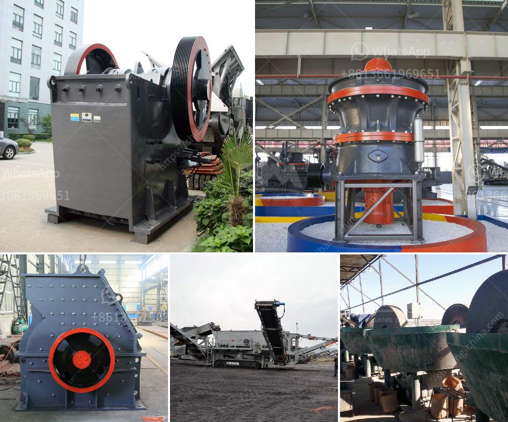

<h3>100 tonnes crusher for sale south africa</h3>
The crushing industry has seen significant advancements in recent years, paving the way for efficient and productive crushers. Among the notable innovations is the 100-tonnes crusher, a powerful machine designed to offer dependable crushing capabilities. This article explores the features, benefits, and relevance of this equipment for companies in South Africa seeking to enhance their operations.

The 100-tonnes crusher represents a breakthrough in the field of crushing machines with its ability to crush large volumes of materials efficiently and effectively. Offering high capacity and reliable performance, this machine is designed to cater to the demanding requirements of various industries, such as mining, construction, and quarrying.

Equipped with cutting-edge technology, the 100-tonnes crusher boasts several key features. These include a robust design, heavy-duty construction, and a powerful engine to ensure optimal performance and durability. Additionally, the machine offers adjustable settings for different material outputs, precise control, and ease of maintenance. Its user-friendly interface and safety features further enhance its appeal in demanding work environments.

The 100-tonnes crusher finds numerous applications in South Africa's mining, construction, and quarrying sectors. With its exceptional capabilities, this machine excels at crushing rock, coal, ore, and other materials into precise sizes necessary for various operations. Whether it's extracting minerals from underground mines, constructing infrastructure, or processing aggregates for road construction projects, this crusher is a reliable asset for companies seeking increased productivity and cost-effectiveness.

By investing in the 100-tonnes crusher, companies in South Africa can significantly enhance their operational efficiency. This machine's ability to crush large volumes of materials saves time, eradicates the need for multiple crushing cycles, and minimizes downtime, leading to increased productivity. Furthermore, the crusher's robust design reduces the risk of breakdowns or maintenance-related delays, ensuring uninterrupted operations. This technology-driven solution empowers businesses to meet high crushing demands while streamlining their overall processes.

The 100-tonnes crusher represents a game-changer for industries in South Africa, offering an effective and efficient solution for large-scale crushing requirements. With its high capacity, exceptional performance, and added safety features, this machine contributes to increased productivity, improved cost-effectiveness, and enhanced operational efficiency. Its widespread applications make it an indispensable asset for companies across various sectors.
<h3>Contact us</h3><ul><li><strong>Whatsapp:&nbsp;<a href="https://wa.me/8613661969651">+8613661969651</a></strong></li><li><a href="https://swt.shibang-china.com/?git&amp;zhl&amp;100 tonnes crusher for sale south africa"><strong>Online Service(chat now)</strong></a></li></ul><h3>Related</h3><ul><li><a href='tons per year gypsum powder production line.md'>tons per year gypsum powder production line</a></li><li><a href='quarry crusher in nigeria.md'>quarry crusher in nigeria</a></li><li><a href='how to control partials size in vertical hammer mill.md'>how to control partials size in vertical hammer mill</a></li><li><a href='process chart of sand washing plant.md'>process chart of sand washing plant</a></li><li><a href='hammer mill santa cross.md'>hammer mill santa cross</a></li></ul>