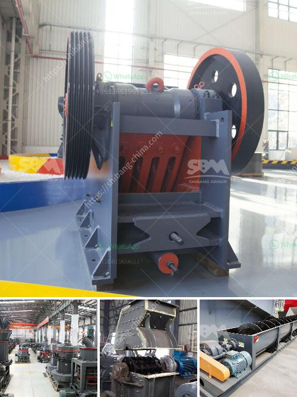

<h3>100 tph stone crushers with vsi in india</h3>
Stone crushers are increasingly being used in industries like construction and mining in India to help eliminate the need for drilling and blasting. These crushers have a 100-200 TPH capacity range. There are, however, numerous reasons why 100 TPH stone crushers are extremely popular in India.

Firstly, they offer a high capacity output. With a maximum capacity of 100 TPH, these crushers are capable of producing large quantities of aggregate materials for various projects. This is especially beneficial for construction companies, where high-quality aggregate is required to strengthen concrete structures.

Secondly, the crushers come with a VSI (Vertical Shaft Impactor) feature. VSI crushers use a high-speed rotor and anvils for impact crushing rather than compression force. This results in a product with superior cubical shape and better gradation, making it suitable for road construction and concrete production. Additionally, VSI crushers can handle a wide range of materials, including hard rocks, making them versatile in different applications.

Moreover, the 100 TPH stone crushers are usually highly cost-effective. Compared to other crushers in the market, these crushers offer a significant reduction in operating costs. They consume less power, require less maintenance, and have longer service lives. This makes them ideal for businesses looking to optimize their operational costs without compromising on quality.

Furthermore, these crushers are highly mobile. They can be easily transported from one site to another, allowing for greater flexibility and convenience in various project locations. This is particularly essential in India, where construction and mining sites are often spread across different regions.

In conclusion, the 100 TPH stone crushers with VSI in India offer a versatile and cost-effective solution for aggregate production in various industries. Their outstanding capacity and superior product quality make them highly popular among construction companies. The VSI feature ensures a better gradation and cubical shape, making them suitable for road construction and concrete production. With their mobility and cost-effectiveness, these crushers are the go-to choice for businesses seeking efficient and reliable stone crushing solutions in India.
<h3>Contact us</h3><ul><li><strong>Whatsapp:&nbsp;<a href="https://wa.me/8613661969651">+8613661969651</a></strong></li><li><a href="https://swt.shibang-china.com/?git&amp;zhl&amp;100 tph stone crushers with vsi in india"><strong>Online Service(chat now)</strong></a></li></ul><h3>Related</h3><ul><li><a href='stone crushers manufacturer.md'>stone crushers manufacturer</a></li><li><a href='mobile stone crushers south africa.md'>mobile stone crushers south africa</a></li><li><a href='mobile diamond washing plant for sale.md'>mobile diamond washing plant for sale</a></li><li><a href='crusher price in oman.md'>crusher price in oman</a></li><li><a href='coal crusher manufacturing machine.md'>coal crusher manufacturing machine</a></li></ul>