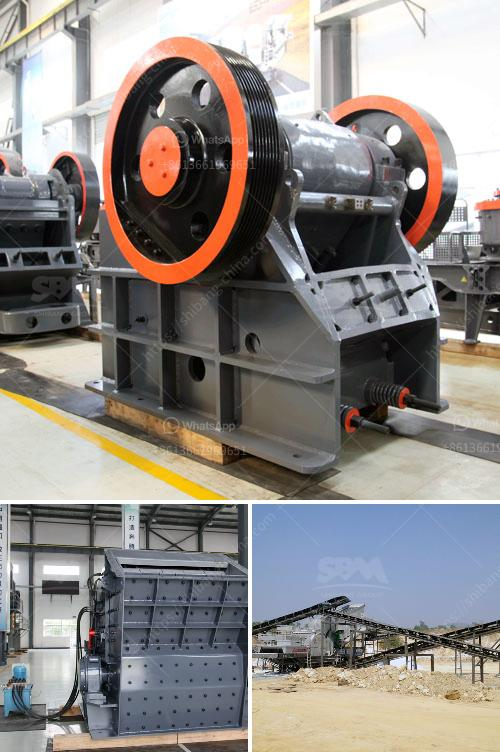

<h3>1000 ton crusher</h3>
The 1000-ton crusher is a crusher machine designed for breaking large rocks and stones into smaller pieces. It is used in various industries including mining, construction, metallurgy, and chemical processing. This powerful machine is capable of crushing rocks of up to 1.5 meters in diameter.

The crusher works by using a set of hydraulic cylinders to apply enormous pressure on the rocks. It utilizes a high-speed rotating hammer that strikes the rocks repeatedly until they break into smaller fragments. The broken pieces are then discharged through a specially designed discharge chute.

One of the key features of the 1000-ton crusher is its versatility. It can be used for a wide range of applications such as crushing limestone, granite, basalt, and other hard and abrasive rocks. Additionally, it can also handle softer materials like concrete and asphalt.

In the mining industry, this crusher is often used to break down large rocks into smaller ones, making them easier to transport and process. It is commonly used in open-pit mines and quarries to extract valuable minerals like gold, silver, copper, and iron. By reducing the size of the ore, the crusher helps optimize the efficiency of downstream processes such as grinding and flotation.

The construction industry also benefits from the 1000-ton crusher's capabilities. It is often used in the production of aggregate materials for concrete and asphalt. The crusher can process large quantities of rocks, producing crushed stones of various sizes that are then used as a base material for roads, buildings, and other infrastructure projects.

Metallurgical plants utilize the 1000-ton crusher to prepare raw materials for further processing. The machine is used to crush and size different types of ores and minerals, including iron ore, copper ore, and zinc ore. By reducing the size of these materials, the crusher improves the efficiency of downstream processes such as smelting and refining.

Chemical processing plants also make use of the 1000-ton crusher in their operations. It can be used to crush and pulverize different chemical compounds, enabling better mixing and dissolution. This is particularly useful in industries like fertilizer manufacturing, where raw materials need to be finely ground before they can be further processed.

In conclusion, the 1000-ton crusher is a powerful machine used in various industries to break down large rocks and stones into smaller pieces. It finds applications in mining, construction, metallurgy, and chemical processing. This versatile crusher offers the ability to process diverse materials, making it an essential tool in many industrial operations.
<h3>Contact us</h3><ul><li><strong>Whatsapp:&nbsp;<a href="https://wa.me/8613661969651">+8613661969651</a></strong></li><li><a href="https://swt.shibang-china.com/?git&amp;zhl&amp;1000 ton crusher"><strong>Online Service(chat now)</strong></a></li></ul><h3>Related</h3><ul><li><a href='used crusher for sale sell buy.md'>used crusher for sale sell buy</a></li><li><a href='diagram of coal conveyor tunnel.md'>diagram of coal conveyor tunnel</a></li><li><a href='lime stone grinder mill.md'>lime stone grinder mill</a></li><li><a href='hammer mill design drawing pdf.md'>hammer mill design drawing pdf</a></li><li><a href='crushing complete crushing plant 80 120tph hard rock.md'>crushing complete crushing plant 80 120tph hard rock</a></li></ul>