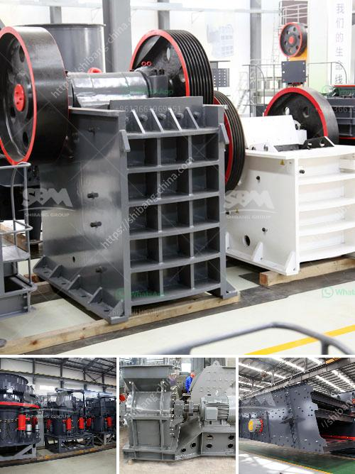

<h3>100tpd cement grinding unit cost</h3>
A cement grinding unit is a vital component of the cement industry. Many cement plants have cement grinding units located in proximity to the clinker production unit to ensure optimum utilization of resources.

A cement grinding unit helps in establishing a site close to the market for a lower transportation cost per ton of cement. This also helps in reducing carbon emissions due to the shorter distances travelled. In addition, cement grinding units provide flexibility in cement production, as they can utilize different additives and materials to produce various types of cement.

The cost of setting up a cement grinding unit can vary depending on the specific requirements of the project. In general, there are two main factors that determine the cost: the size of the unit and the amount of clinker produced.

A 100tpd cement grinding unit can be established on a small scale and can be purchased as a stand-alone unit or as part of a larger cement plant. In either case, the unit consumes energy, and electricity costs are a significant expense. The cost of electricity varies depending on the location of the unit and the tariff rates set by the local government.

The cost of a 100tpd cement grinding unit also includes labor costs. Skilled workers are required to operate the unit and ensure smooth operations. Additionally, maintenance and repair costs need to be factored into the overall budget. These costs can vary depending on the type of equipment used and the complexity of the machinery.

Another important cost factor is the cost of raw materials. Cement grinding units require clinker, gypsum, and other additives to produce cement. The cost of these raw materials can vary depending on their availability and market prices. It is essential to establish long-term relationships with reliable suppliers to ensure a consistent supply of high-quality raw materials at competitive prices.

Beyond the initial investment, ongoing operational costs need to be taken into account. These costs can include fuel for grinding, packing, and transportation, as well as administrative expenses such as licenses and permits.

Given the complexity involved in setting up and operating a cement grinding unit, it is essential to conduct a feasibility study before making any financial commitments. This study should consider various key factors, including projected market demand, competition analysis, and financial projections.

In conclusion, the cost of a 100tpd cement grinding unit can vary depending on several factors, including size, location, labor, raw material costs, and operational expenses. It is crucial to conduct thorough research and analysis to determine the feasibility and profitability of such a project. Taking into account all these factors, a well-executed cement grinding unit can contribute significantly to the overall success of a cement plant.
<h3>Contact us</h3><ul><li><strong>Whatsapp:&nbsp;<a href="https://wa.me/8613661969651">+8613661969651</a></strong></li><li><a href="https://swt.shibang-china.com/?git&amp;zhl&amp;100tpd cement grinding unit cost"><strong>Online Service(chat now)</strong></a></li></ul><h3>Related</h3><ul><li><a href='balls level in ball mill.md'>balls level in ball mill</a></li><li><a href='micro grinding machine.md'>micro grinding machine</a></li><li><a href='crusher manufacturer in saudi.md'>crusher manufacturer in saudi</a></li><li><a href='used stone crushing equipment in assam.md'>used stone crushing equipment in assam</a></li><li><a href='mining calcium carbonate vietnam.md'>mining calcium carbonate vietnam</a></li></ul>