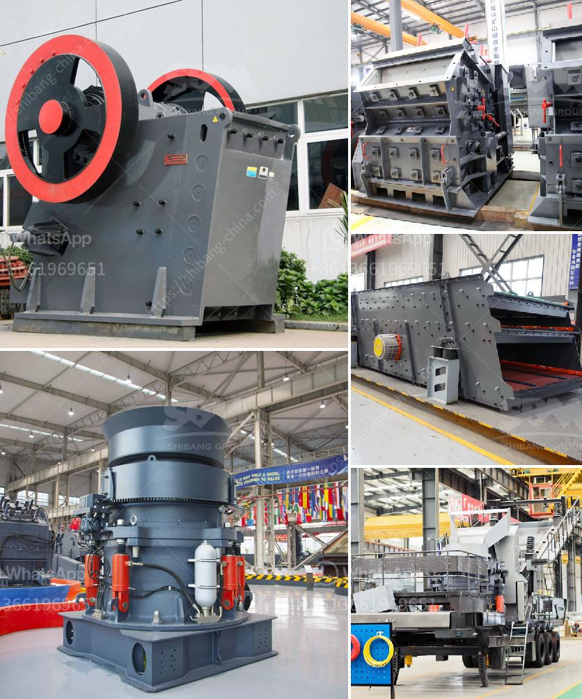

<h3>100tph jaw crusher and ball mill</h3>
A jaw crusher and ball mill are two essential equipment for the mining industry. They are used for crushing and grinding various materials, but they operate in different ways. In this article, we will focus on the 100tph jaw crusher and ball mill.

The jaw crusher is a robust and powerful machine designed to crush the toughest materials. It offers high efficiency and low cost per tonne, making it perfect for crushing large rocks and ores. The 100tph jaw crusher is equipped with a fixed jaw plate and a moving jaw plate, both made of high-quality manganese steel. This ensures maximum strength and durability, allowing the crusher to withstand heavy loads.

On the other hand, the ball mill is used for grinding materials into a fine powder. It is a versatile device that can handle both wet and dry grinding processes. The 100tph ball mill comes with a rotating cylinder that contains grinding balls, which are continuously crushed and ground by the rotation of the cylinder. This results in a highly efficient and effective grinding process.

When used together, the jaw crusher and ball mill form a complete crushing and grinding system. They can be used in various industries, including mining, construction, and chemical engineering. The combination of these two machines allows for the efficient processing of materials, leading to increased productivity and reduced costs.

In conclusion, the 100tph jaw crusher and ball mill are essential equipment for the mining industry. They offer high efficiency and low cost per tonne, making them ideal for crushing and grinding various materials. Whether used separately or together, they provide a complete crushing and grinding solution for various industries.
<h3>Contact us</h3><ul><li><strong>Whatsapp:&nbsp;<a href="https://wa.me/8613661969651">+8613661969651</a></strong></li><li><a href="https://swt.shibang-china.com/?git&amp;zhl&amp;100tph jaw crusher and ball mill"><strong>Online Service(chat now)</strong></a></li></ul><h3>Related</h3><ul><li><a href='cement plant cost estimation cement plant cost.md'>cement plant cost estimation cement plant cost</a></li><li><a href='aggregate production process.md'>aggregate production process</a></li><li><a href='hammer mill crusher.md'>hammer mill crusher</a></li><li><a href='vertical mill for slag grinding.md'>vertical mill for slag grinding</a></li><li><a href='cement manufacturing processes.md'>cement manufacturing processes</a></li></ul>