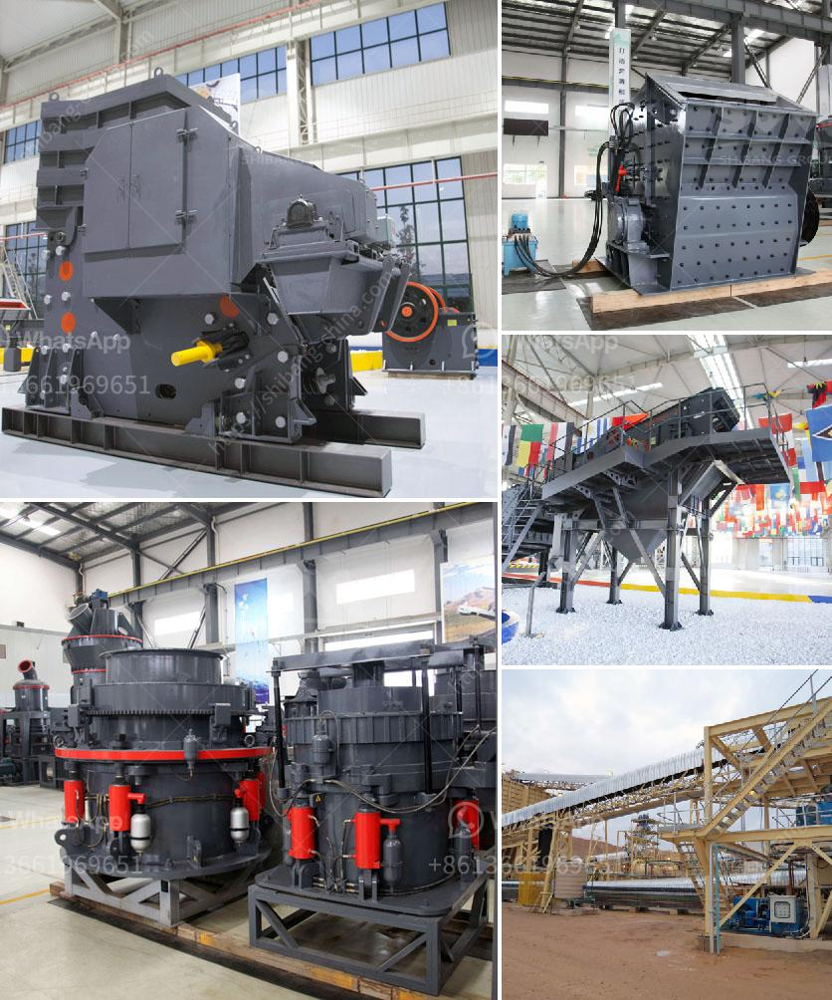

<h3>100tph rock plant used for sale</h3>
In today's fast-paced construction industry, the demand for reliable and efficient rock plants is higher than ever. These plants play a crucial role in extracting, refining, and processing various types of rocks and minerals for use in construction materials. One such reliable option is the 100TPH rock plant, which has gained prominence due to its versatility and exceptional performance. In this article, we will delve into the features and benefits of this rock plant and explore why it is a preferred choice for many construction businesses.

1. Robust Crushing Capacity: The 100TPH rock plant is capable of processing a wide range of rocks and minerals due to its high crushing capacity. It efficiently handles materials with hardness up to 320MPa, ensuring a smooth and consistent production process.

2. Versatile Application: Designed to address multiple construction needs, this rock plant allows for the production of various types of aggregates, including crushed stone, sand, and gravel. It ensures a consistent supply of high-quality materials required for road construction, concrete production, and other infrastructure projects.

3. Energy-efficient Operations: Equipped with advanced technology and modern components, the 100TPH rock plant maximizes energy efficiency. Its intelligent automation system optimizes power consumption and reduces operating costs, supporting sustainable and eco-friendly practices.

4. Easy Maintenance and Longevity: Regular maintenance is vital for the smooth functioning of any machinery, and the 100TPH rock plant lives up to this requirement. Designed with user-friendly features and easily accessible parts, maintenance tasks become hassle-free, resulting in reduced downtime and increased productivity.

The 100TPH rock plant presents an attractive option for construction businesses searching for a reliable and versatile solution to meet their rock processing needs. With its robust crushing capacity, versatility in application, energy-efficient operations, and easy maintenance, this plant offers an ideal combination of performance and practicality. Acquiring a used 100TPH rock plant for sale provides an excellent opportunity to benefit from its outstanding features while saving costs. As the demand for construction materials continues to rise, investing in a reliable rock plant like the 100TPH model can prove to be a valuable asset in achieving successful and profitable construction projects.
<h3>Contact us</h3><ul><li><strong>Whatsapp:&nbsp;<a href="https://wa.me/8613661969651">+8613661969651</a></strong></li><li><a href="https://swt.shibang-china.com/?git&amp;zhl&amp;100tph rock plant used for sale"><strong>Online Service(chat now)</strong></a></li></ul><h3>Related</h3><ul><li><a href='conveyor belts price.md'>conveyor belts price</a></li><li><a href='stone crusher plant for sale philippines.md'>stone crusher plant for sale philippines</a></li><li><a href='vibrating classifiing screen.md'>vibrating classifiing screen</a></li><li><a href='ton per day crusher barmac.md'>ton per day crusher barmac</a></li><li><a href='prices of harmer mills in south africa.md'>prices of harmer mills in south africa</a></li></ul>