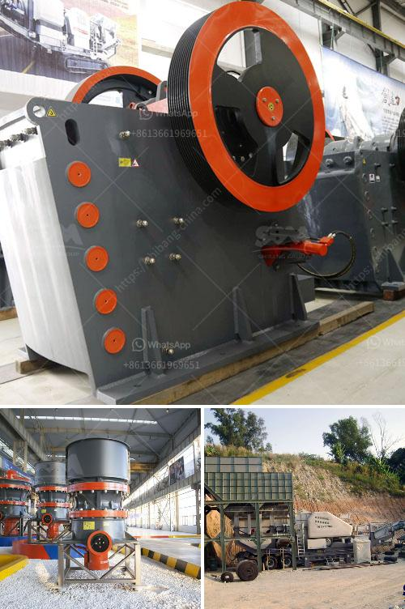

<h3>150 ton capacity per day manufacture of grinding mill</h3>
Title: Excavating a New Era of Industrial Efficiency: 150 Ton Capacity per Day Manufacture of Grinding Mill

The grinding mill industry is a vital component of modern manufacturing, enabling the transformation of raw materials into valuable powders utilized in numerous sectors. Achieving high production capacity while maintaining quality is a persistent challenge for mill manufacturers. However, a groundbreaking innovation has emerged – a grinding mill with an unparalleled capacity of 150 tons per day. This article aims to explore the manufacturing process, economic implications, and potential benefits brought about by this exceptional industrial breakthrough.

The manufacture of a grinding mill with a colossal 150-ton daily capacity is a testament to cutting-edge engineering and advanced machinery. The process begins with the selection of top-grade materials, ensuring the mill's durability and longevity. Skilled technicians supervise the construction, using computer-aided design tools to ensure precision and accuracy throughout the assembly.

The sheer scale of this endeavor demands meticulous attention to detail. Each component is carefully machined and calibrated to exact specifications. State-of-the-art welding techniques are applied to construct the mill's robust structure. Following assembly, rigorous testing and quality control measures ensure optimal functionality and adherence to industry standards.

The introduction of a grinding mill with a capacity as substantial as 150 tons per day has far-reaching consequences for various industries. Firstly, manufacturers can benefit from economies of scale. With such high production output, they can meet burgeoning demands while minimizing operational costs per unit, enhancing profitability.

Furthermore, the increased capacity directly translates into reduced lead times. Clients can receive their orders promptly, improving overall supply chain efficiency. Reduced wait times mean that industries relying on grinding mills can maintain seamless production processes, avoiding costly downtime and interruptions.

The enormous capacity of this grinding mill also opens doors to new opportunities. Manufacturers can explore previously untapped markets, boost export potential, and cater to ever-expanding global demands. The influx of foreign exchange and job creation within the manufacturing sector can significantly contribute to regional economic growth.

The immense capacity of the grinding mill holds immense potential benefits for various industries. Construction companies can utilize the powdered materials to enhance the quality and strength of concrete, improving the durability of infrastructure projects. Industrial sectors reliant on finely ground raw materials, such as pharmaceuticals and ceramics, can experience enhanced productivity and quality control.

Moreover, agricultural applications can also benefit significantly. The grinding mill's high capacity means larger volumes of raw materials, such as grains and fibers, can be transformed into powders used in animal feed or as additives in fertilizers. This capability can enhance the efficiency of livestock production and improve crop yields, contributing to food security.

The advent of a grinding mill with a staggering daily capacity of 150 tons signifies a remarkable achievement in the field of industrial manufacturing. This innovation offers numerous economic implications, improved supply chain efficiency, and potential benefits across various sectors. From enhancing construction projects to revolutionizing agricultural practices, the 150-ton capacity grinding mill opens doors to a new era of industrial productivity and efficiency.
<h3>Contact us</h3><ul><li><strong>Whatsapp:&nbsp;<a href="https://wa.me/8613661969651">+8613661969651</a></strong></li><li><a href="https://swt.shibang-china.com/?git&amp;zhl&amp;150 ton capacity per day manufacture of grinding mill"><strong>Online Service(chat now)</strong></a></li></ul><h3>Related</h3><ul><li><a href='used crusher for sale in south africa.md'>used crusher for sale in south africa</a></li><li><a href='stone quarrying equipment.md'>stone quarrying equipment</a></li><li><a href='ball mill manufacturer in inammedabad.md'>ball mill manufacturer in inammedabad</a></li><li><a href='equipment needed for coal mining.md'>equipment needed for coal mining</a></li><li><a href='pebble stone processing machines.md'>pebble stone processing machines</a></li></ul>