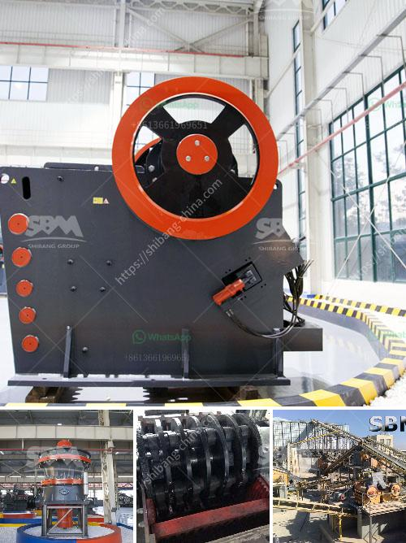

<h3>200 ton crusher price</h3>
The demand for crushers in various industries such as mining, construction, and recycling has been on the rise. Crushers are essential equipment in the process of reducing large rocks into smaller, more manageable sizes. One such crusher that is garnering attention in the market is the 200-ton crusher.

The term "200-ton crusher" refers to the capacity of the crusher to crush 200 metric tons of material per hour. This capacity makes it one of the larger crushers available in the market. With such a high capacity, the 200-ton crusher proves to be a formidable machine for tackling large quantities of material effectively and efficiently.

When considering the price of a 200-ton crusher, it is important to take into account several factors. The primary factor is the quality and durability of the machine. A high-quality crusher will ensure that it can withstand the demanding tasks it is meant to perform and have a longer lifespan. This, in turn, contributes to better operational efficiency and reduced downtime.

Additionally, the manufacturer or brand of the 200-ton crusher plays a significant role in determining the price. Established brands with a solid reputation in the industry may have higher prices compared to lesser-known brands. However, investing in a reputable brand often ensures better service, reliable spare parts availability, and excellent after-sales support.

Furthermore, the market demand and competition also influence the pricing of the 200-ton crusher. If there is a high demand for crushers and limited competition, the price may be set at a premium. Conversely, if there is an abundance of options available, the price may be more competitive.

In conclusion, the price of a 200-ton crusher is influenced by several factors, including the machine's quality, the brand, market demand, and competition. It is crucial for buyers to carefully evaluate these factors to make an informed decision. Investing in a high-quality crusher can not only optimize operational efficiency but also have long-term cost benefits.
<h3>Contact us</h3><ul><li><strong>Whatsapp:&nbsp;<a href="https://wa.me/8613661969651">+8613661969651</a></strong></li><li><a href="https://swt.shibang-china.com/?git&amp;zhl&amp;200 ton crusher price"><strong>Online Service(chat now)</strong></a></li></ul><h3>Related</h3><ul><li><a href='jaw crusher private sale south africa.md'>jaw crusher private sale south africa</a></li><li><a href='cone crushers washing system.md'>cone crushers washing system</a></li><li><a href='stone quarrying process.md'>stone quarrying process</a></li><li><a href='limestone crushing equipment.md'>limestone crushing equipment</a></li><li><a href='ethiopia conveyor belts china.md'>ethiopia conveyor belts china</a></li></ul>