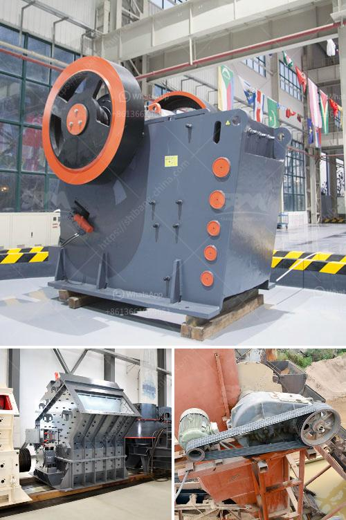

<h3>21 10 jaw crusher price in south afirca</h3>
The 21 10 jaw crusher is a commonly used model in the mining industry and has been widely recognized as a primary crushing equipment for various types of stone ores in many countries. With a combination of advanced technology and professional personnel, the 21 10 jaw crusher in South Africa has a high reduction ratio and high capacity, making it suitable for a variety of applications.

One of the key features of the 21 10 jaw crusher is its capability to process a wide range of materials with a feed size of up to 500mm. This means that it can handle various types of materials, including hard rock, limestone, quartz, and basalt, among others. The high capacity of the machine ensures that it can effectively crush large quantities of material in a single pass, reducing the need for multiple crushing stages and saving time and energy.

In terms of performance, the 21 10 jaw crusher is known for its superior crushing efficiency. With its powerful motor and sturdy construction, it can deliver consistent and uniform particle size reduction, resulting in a high-quality final product. The machine's adjustable settings allow for precise control over the particle size output, making it suitable for a wide range of applications, including aggregate production, mining operations, and recycling.

Apart from its impressive performance, the 21 10 jaw crusher also offers users a cost-effective solution. Compared to other models in the market, this particular jaw crusher is known for its competitive price, making it an attractive option for both small and large-scale mining operations. Additionally, the machine's low maintenance requirements and durable components contribute to its overall cost-effectiveness, ensuring long-term savings for users.

The availability of the 21 10 jaw crusher in South Africa is another benefit. With various suppliers offering competitive prices, this type of jaw crusher is widely accessible from different parts of the country. The low transport costs contribute to the overall affordability of the product, making it an ideal choice for businesses operating on a budget or in remote locations.

In conclusion, the 21 10 jaw crusher is a reliable and efficient primary crushing solution that offers high performance and competitive pricing. Its ability to handle various materials and produce high-quality output makes it suitable for a variety of applications in the mining industry. The availability and affordability of this jaw crusher in South Africa further enhance its appeal, making it a popular choice among miners and operators. Whether for primary crushing or secondary crushing purposes, the 21 10 jaw crusher is a reliable and cost-effective option.
<h3>Contact us</h3><ul><li><strong>Whatsapp:&nbsp;<a href="https://wa.me/8613661969651">+8613661969651</a></strong></li><li><a href="https://swt.shibang-china.com/?git&amp;zhl&amp;21 10 jaw crusher price in south afirca"><strong>Online Service(chat now)</strong></a></li></ul><h3>Related</h3><ul><li><a href='jaw crusher seller in philippines pakistan.md'>jaw crusher seller in philippines pakistan</a></li><li><a href='sri lankan building sand price.md'>sri lankan building sand price</a></li><li><a href='argentine hammer mills.md'>argentine hammer mills</a></li><li><a href='quarry stone crusher for sale in south africa.md'>quarry stone crusher for sale in south africa</a></li><li><a href='sample method statement stone crushing.md'>sample method statement stone crushing</a></li></ul>