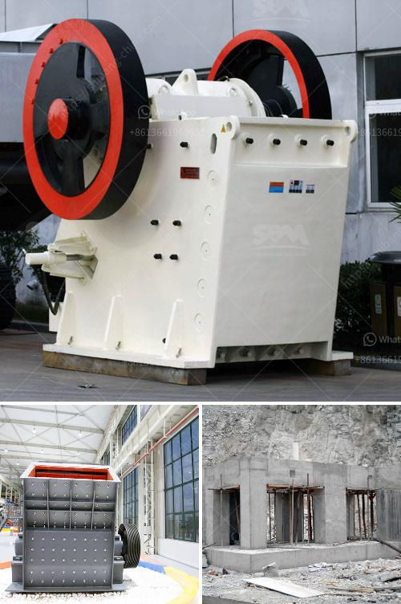

<h3>3 roll mills machine manufacturers in europe</h3>
Europe is known for its advanced manufacturing industry, and the three roll mills machine sector is no exception. With a rich history of innovation and expertise, European manufacturers have established themselves as leaders in this field. In this article, we will explore three prominent three roll mills machine manufacturers in Europe.

First on our list is Exakt, a German company that specializes in precision engineering and manufacturing of three roll mills machines. With over 65 years of experience, Exakt has honed its expertise, ensuring top-quality products. Their machines are widely used in various industries such as pharmaceuticals, cosmetics, and chemical manufacturing.

One of Exakt's notable offerings is the Exakt 120E model, which is equipped with state-of-the-art features. This machine boasts automatic common settings, ensuring consistent and precise results. Additionally, it comes with a reliable safety system that protects both the operator and the machine.

Another renowned manufacturer is Bühler Group, based in Switzerland. With a strong focus on innovation, Bühler has been at the forefront of the milling industry for over 150 years. Apart from three roll mills machines, the company offers a wide range of solutions for various processes, including grinding, mixing, and dispersing.

Bühler's three roll mills machines are widely used in the production of paints, inks, and coatings. The company's machines are known for their robust construction and high-quality components, ensuring long-term reliability. Bühler also offers customization options, allowing customers to tailor the machine to their specific needs.

Last but not least, we have IKA-Werke GmbH, a German manufacturer known for its cutting-edge laboratory and analytical equipment. IKA's three roll mills machines are designed for precise and efficient mixing and dispersing of various materials. The company's machines are widely used in the pharmaceutical, food, and chemical industries.

IKA's flagship model, the T65, is equipped with advanced cooling mechanisms, ensuring efficient operation and preventing overheating. The machine also features a digital control panel, enabling precise adjustment of parameters such as speed and time. Moreover, IKA offers comprehensive after-sales support, including maintenance and training services.

In conclusion, European manufacturers are at the forefront of the three roll mills machine industry, offering advanced and reliable solutions. Exakt's precision engineering, Bühler's focus on innovation, and IKA's advanced laboratory equipment make these companies stand out in the market. As Europe continues to drive forward technological advancements, we can expect these manufacturers to deliver even more cutting-edge solutions in the future.
<h3>Contact us</h3><ul><li><strong>Whatsapp:&nbsp;<a href="https://wa.me/8613661969651">+8613661969651</a></strong></li><li><a href="https://swt.shibang-china.com/?git&amp;zhl&amp;3 roll mills machine manufacturers in europe"><strong>Online Service(chat now)</strong></a></li></ul><h3>Related</h3><ul><li><a href='kaolin crusher processing machine.md'>kaolin crusher processing machine</a></li><li><a href='price of stone crushers in malaysia.md'>price of stone crushers in malaysia</a></li><li><a href='tanzania medical equipment supplier.md'>tanzania medical equipment supplier</a></li><li><a href='jaw crushers in harare zimbabwe.md'>jaw crushers in harare zimbabwe</a></li><li><a href='how to start a cement factory.md'>how to start a cement factory</a></li></ul>