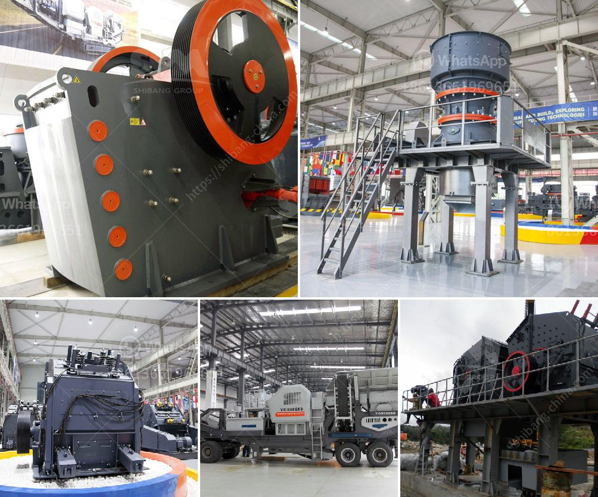

<h3>3 stamp gold mill pictures</h3>
In the annals of history, gold mining has always held a place of prominence. One of the most iconic objects associated with this industry is the 3-stamp gold mill. Though now a relic of the past, their images have been captured and preserved, providing us with a window into the grandeur and ingenuity of the era. In this article, we will delve into the significance of 3-stamp gold mill pictures and explore the fascinating world they illuminate.

The primary aim of a 3-stamp gold mill was to crush rocks and subsequently extract precious metals, primarily gold. Stamp mills revolutionized the mining industry during the late 19th century, enabling miners to process vast quantities of gold ore. Each stamp was a large, heavy metal hammer, operated manually or mechanically, allowing the processing of ore efficiently.

By analyzing 3-stamp gold mill pictures, one gains insights into the mills' intricate operation. These photos depict the apparatus composed of heavy stamp heads mounted on a camshaft. The camshaft would lift the heavy stamp heads, which would then fall, crushing rocks into smaller pieces. Water and gravity were used to facilitate the ongoing process, ensuring a continuous flow of ore for crushing, and a subsequent extraction of gold from the pulverized rock.

The advent of stamp mills transformed the mining industry. They provided a significantly more efficient alternative to manual rock crushing methods, which were slow and inefficient. 3-stamp gold mills amplified production capacities, enabling miners to process higher volumes of ore in less time. This technological leap dramatically increased the potential profits and productivity of gold mining operations, leading to a gold rush worldwide.

The preservation of 3-stamp gold mill pictures has become an invaluable resource for historians, providing a visual representation of how gold mining evolved. These images hold extraordinary historical significance, chronicling an era of ambition, technological advancement, and economic growth.

Beyond the technical aspects, 3-stamp gold mill pictures offer a glimpse into the lives of miners during this period. These images reveal the arduous conditions they endured, from the strenuous labor associated with operating the mills to the rugged lifestyles that accompanied the pursuit of gold. Additionally, the photographs showcase mining camps, depicting the makeshift dwellings and communities that sprung up around these bustling operations.

The allure of gold has captured the human imagination throughout history, driving exploration, innovation, and adventure. 3-stamp gold mill pictures provide a tangible connection to this captivating era, offering modern-day observers a visual journey into the past. As we marvel at the intricate machinery and the perseverance of gold miners, these images serve as a testament to the ingenuity and determination that define human progress.
<h3>Contact us</h3><ul><li><strong>Whatsapp:&nbsp;<a href="https://wa.me/8613661969651">+8613661969651</a></strong></li><li><a href="https://swt.shibang-china.com/?git&amp;zhl&amp;3 stamp gold mill pictures"><strong>Online Service(chat now)</strong></a></li></ul><h3>Related</h3><ul><li><a href='diesel grinding mills musina south africa.md'>diesel grinding mills musina south africa</a></li><li><a href='cement factories equipment in south africa.md'>cement factories equipment in south africa</a></li><li><a href='ton per day crusher barmac.md'>ton per day crusher barmac</a></li><li><a href='cost quarry machines.md'>cost quarry machines</a></li><li><a href='crusher business aggregate.md'>crusher business aggregate</a></li></ul>