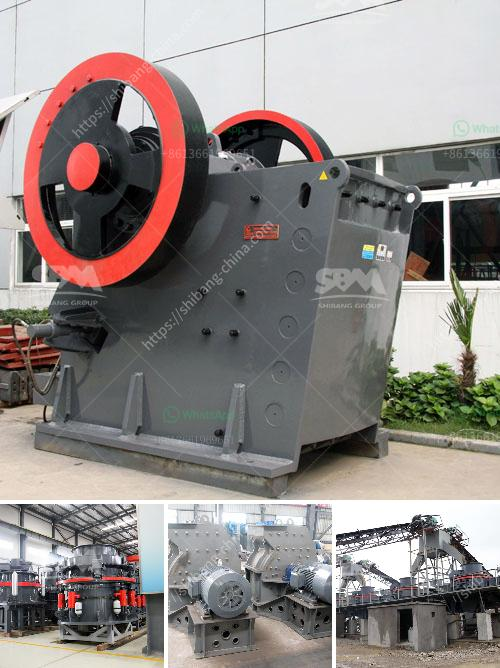

<h3>30 x 42 portable jaw crusher for sale</h3>
In the ever-evolving world of construction and mining, finding the right equipment for your job is crucial. One such innovative and versatile equipment is the portable jaw crusher. Durable, efficient, and reliable, it provides excellent performance in various applications. This article explores the benefits and features of the 30 x 42 portable jaw crusher, shedding light on why it is the preferred choice for contractors and resource extraction operations.

The 30 x 42 portable jaw crusher is designed for convenient transportation and installation, making it an ideal choice for most applications. Ensuring smooth operation even in the most demanding environments, this portable crusher is easy to transport and can be deployed quickly to maximize productivity at any job site.

With its robust build, the portable jaw crusher is capable of processing a wide range of materials. It excels at primary crushing applications, where size reduction is required. Whether it's recycling concrete, quarrying, or mining, this crusher can conveniently handle diverse material types, including limestone, granite, and even softer materials like ore.

Equipped with a powerful engine, the 30 x 42 portable jaw crusher delivers high efficiency and productivity to any operation. Its advanced crushing technology ensures consistent product size, resulting in higher throughput and reduced downtime. The adjustable jaw settings allow for precise control over the size of the end product, enabling contractors to meet diverse job requirements.

Built to withstand tough operating conditions, the 30 x 42 portable jaw crusher is engineered using high-quality materials and components. The robust construction ensures a long lifespan and reliable performance, reducing the need for costly repairs and downtime. This crusher is designed to handle heavy-duty applications, providing operators with confidence and peace of mind.

The portable jaw crusher prioritizes operator safety and ease of use. Its user-friendly control panel allows for intuitive operation, ensuring efficient and safe production. Additionally, the crusher is equipped with hydraulic release capabilities to prevent damage caused by uncrushable materials, providing added convenience and peace of mind to operators.

The 30 x 42 portable jaw crusher is an impressive piece of machinery that enhances your efficiency and productivity. With its mobility, versatility, and user-friendly features, it is an excellent option for contractors and resource extraction operations seeking reliable and efficient crushing equipment. Its durability, high productivity, and ease of use make it a valuable addition to any job site, allowing operators to tackle a wide range of applications and produce quality end products. Whether in construction, quarrying, or mining, the 30 x 42 portable jaw crusher is a reliable partner that empowers your business to thrive.
<h3>Contact us</h3><ul><li><strong>Whatsapp:&nbsp;<a href="https://wa.me/8613661969651">+8613661969651</a></strong></li><li><a href="https://swt.shibang-china.com/?git&amp;zhl&amp;30 x 42 portable jaw crusher for sale"><strong>Online Service(chat now)</strong></a></li></ul><h3>Related</h3><ul><li><a href='ethiopia conveyor belt india.md'>ethiopia conveyor belt india</a></li><li><a href='100 tonnes crusher for sale south africa.md'>100 tonnes crusher for sale south africa</a></li><li><a href='aggregate washing machine saudi arabia.md'>aggregate washing machine saudi arabia</a></li><li><a href='cement clinker manufacturing machine.md'>cement clinker manufacturing machine</a></li><li><a href='portable concrete crusher for rent qatar.md'>portable concrete crusher for rent qatar</a></li></ul>