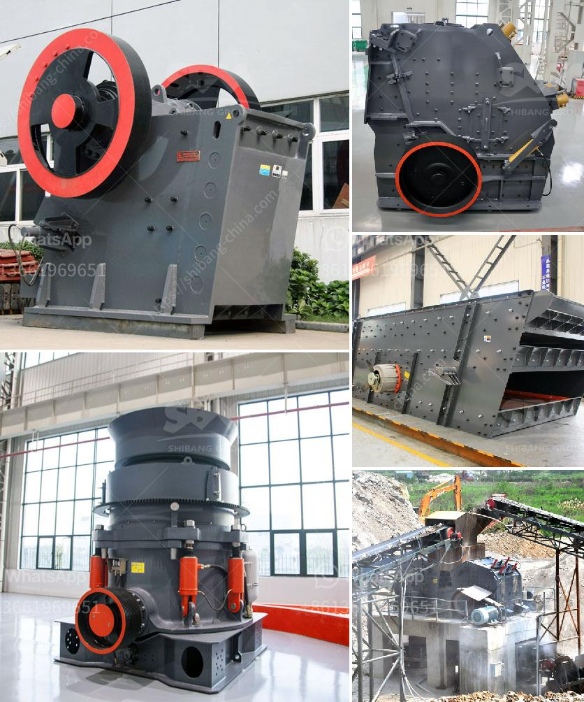

<h3>300 tph cone crusher price</h3>
The cone crusher is widely used for secondary and fine crushing in the fields of mining, chemical industry, building materials, metallurgy and so on. It can crush materials with Moh's scale in middle and high hardness such as ironstone, copper ore, limestone, quartz, granite, rock and so on. As a professional cone crusher manufacturer, Great Wall cone crusher produces high quality cone crusher, and ensures the cone crusher quality and safe production.

Great Wall Cone crusher is mainly divided into spring cone crusher and CZS high efficient cone crusher. Cone crusher price is one of important factors to select cone crusher in stone crushing plant. There are so many reasons effect cone crusher price , such as cone crusher supplier, cone crusher brand, cone crusher models and cone crusher quality. Great Wall Company introduce you the working parameters of 300 tph cone crusher and give you some suggestions on cone crusher model selection.

Firstly,cone crusher production capacity is decided by cone crusher diameter and cone crusher cavity. Great Wall cone crusher mainly refer to PY spring cone crusher, CZS cone crusher and HCC hydraulic cone crusher. Our cone crusher can also classified into short head cone crusher and standard cone crusher in stone crushing plant. Secondly, cone crusher price changes with the cone crusher type and cone crusher model.

Different cone crusher types and models have various discharging mechanism, so cone crusher prices vary based on the actual needs of customers. Lastly, there are many factors affecting cone crusher capacity, such as cone crusher model, input size, output size range etc. Cone crusher price is also affected by cone crusher model. Who propose cone crusher price certainly depends on cone crusher technical advantages and production cost.

Take cone crusher operation and maintenance into consideration, we propose you cone crusher configuration scheme as following. Great Wall Company propose the optimized scheme for 300 tph cone crusher: CZS51B cone crusher is a medium cone crusher, Great Wall Company will give you the suitable cone crusher quotation according to you detailed requirement. Models: CZS51B cone crusher Maximum feed size: 135mm Output size range: 10 mm - 35 mm Output capacity: 150 TPH Cone crusher motor power: 160kw Cone crusher weight: 26 T

In conclusion, our cone crusher capacity can meet your different type requirements. If you are interested in cone crusher price or other details, you can contact Great Wall Company online or visit our factory directly. We will provide thorough service to meet your requirements about cone crusher.
<h3>Contact us</h3><ul><li><strong>Whatsapp:&nbsp;<a href="https://wa.me/8613661969651">+8613661969651</a></strong></li><li><a href="https://swt.shibang-china.com/?git&amp;zhl&amp;300 tph cone crusher price"><strong>Online Service(chat now)</strong></a></li></ul><h3>Related</h3><ul><li><a href='grinding of limestone for cement production.md'>grinding of limestone for cement production</a></li><li><a href='portable stone crusher machine usa.md'>portable stone crusher machine usa</a></li><li><a href='used jaw crusher machine for sale nepal.md'>used jaw crusher machine for sale nepal</a></li><li><a href='indonesia vertical grinding machine.md'>indonesia vertical grinding machine</a></li><li><a href='jual stone crusher philippines.md'>jual stone crusher philippines</a></li></ul>