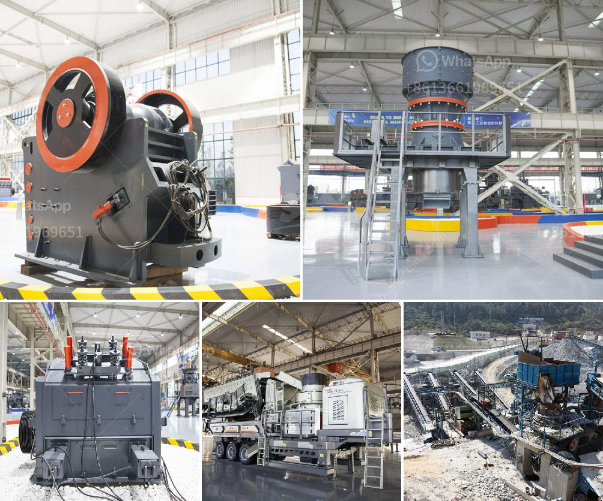

<h3>300tph ball mill manufacturer in philippines</h3>
A ball mill is a type of grinding mill, which is designed to grind and blend materials for use in mineral dressing processes, paints, pyrotechnics, ceramics, and selective laser sintering. The main principle of a ball mill is to reduce the size of the material being broken down by the impact and grinding of it by the balls inside the mill. To accomplish that, manufacturers of ball mill equipment constantly aim to improve their machinery to make the process more efficient, reduce costs, and be more environmentally friendly. They create ball mills that are intended for professional use and are increasingly being adapted for use by hobbyists.

One of the leading manufacturers of ball mill equipment in the Philippines is TPH. Incorporated in 1995, TPH specializes in planning and manufacturing a wide range of grinding equipment, from ball mills and crushers to complete turnkey plants. Its extensive experience and technical expertise, combined with leading-edge technology, have earned TPH a reputation for being a trusted and reliable provider of grinding solutions.

One of TPH's most popular ball mill models is the 1830×3000 ball mill. This machine is specifically designed to handle a large amount of materials. It is capable of grinding 60-100 tons per hour. This capacity range is ideal for customers with high production requirements. The 1830×3000 ball mill can process 300 tph of material and is therefore a great fit for companies in need of a large-scale ball mill.

What sets TPH apart from other ball mill manufacturers is its focus on providing the best quality and customer service. TPH ensures that all its equipment meets international standards and undergoes rigorous testing before being delivered to the customer. Additionally, the company offers comprehensive after-sales support, including maintenance and spare parts.

In conclusion, TPH is a prominent ball mill manufacturer in the Philippines, capable of delivering high-quality machines that meet international standards. Its extensive range of ball mills can process materials up to 300 tph and is known for its exceptional performance, reliability, and efficiency. Whether you require a small-scale ball mill or a large-scale grinding solution, TPH has the right equipment for the job. With its commitment to customer satisfaction and after-sales support, TPH is the preferred choice for companies in the Philippines and beyond.
<h3>Contact us</h3><ul><li><strong>Whatsapp:&nbsp;<a href="https://wa.me/8613661969651">+8613661969651</a></strong></li><li><a href="https://swt.shibang-china.com/?git&amp;zhl&amp;300tph ball mill manufacturer in philippines"><strong>Online Service(chat now)</strong></a></li></ul><h3>Related</h3><ul><li><a href='types of stone crusher with different output size.md'>types of stone crusher with different output size</a></li><li><a href='consultants to help to start a stone crusher.md'>consultants to help to start a stone crusher</a></li><li><a href='mobile rock crushers in ghana.md'>mobile rock crushers in ghana</a></li><li><a href='aggregate production process.md'>aggregate production process</a></li><li><a href='crusher grinder and sieving equipment kaolin.md'>crusher grinder and sieving equipment kaolin</a></li></ul>