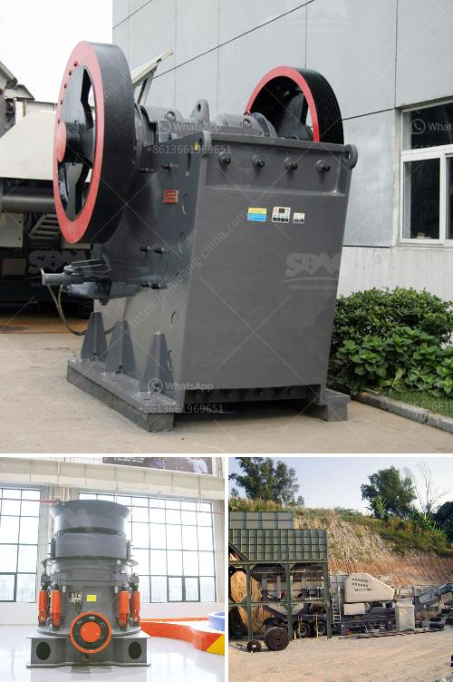

<h3>4 raymond roller mill</h3>
The 4 Raymond Roller Mill is an air-swept vertical ring-roll mill that is designed for high-capacity grinding and fine grinding of various materials. It is ideal for processing limestone, gypsum, bentonite, feldspar, dolomite, talc, marble, kaolin, and other non-metallic minerals. With a capacity range from 1-45 tons per hour, the 4 Raymond Roller Mill is also the perfect solution for low to medium output requirements in different industries.

One of the key features of the 4 Raymond Roller Mill is its automatic control system. This advanced system allows for easy operation and monitoring of various parameters, such as feeding rate, grinding pressure, and fineness. By adjusting these parameters, the mill can accurately control the desired product size and quality, ensuring uniformity and consistency in the final materials.

Furthermore, the 4 Raymond Roller Mill is equipped with multiple grinding rollers, which are tightly pressed on the grinding ring by the centrifugal force generated by the rotating shaft. This unique design not only enhances the grinding efficiency but also prevents the materials from appearing over-ground or under-ground. As a result, the 4 Raymond Roller Mill guarantees excellent particle size distribution and superior grinding performance.

In addition, the 4 Raymond Roller Mill features a centralized control system that enables remote control and real-time monitoring. This allows operators to adjust and optimize the mill's operation from a central location, maximizing productivity and reducing maintenance downtime. With its user-friendly interface, the control system also provides valuable diagnostic information, allowing for quick troubleshooting and problem-solving.

Another advantage of the 4 Raymond Roller Mill is its low energy consumption. The mill is equipped with a high-efficiency centrifugal fan, which effectively reduces the air resistance and power consumption during operation. This energy-saving design not only helps to reduce operational costs but also minimizes the environmental impact, making the mill a sustainable choice for industries that prioritize energy efficiency.

Furthermore, the 4 Raymond Roller Mill is designed with a robust and durable structure. The main mill component, the grinding ring, and the grinding roller are made of high-quality materials, ensuring long-term reliability and stability. This reliable construction enables the mill to withstand heavy-duty use and maintain consistent performance under demanding conditions.

In conclusion, the 4 Raymond Roller Mill is a versatile and efficient grinding solution for various materials. With its automatic control system, multiple grinding rollers, centralized control system, low energy consumption, and robust structure, it is suitable for a wide range of applications. Whether in the mining, construction, or chemical industry, the 4 Raymond Roller Mill offers high-capacity and high-quality grinding, meeting the demands of modern manufacturing processes.
<h3>Contact us</h3><ul><li><strong>Whatsapp:&nbsp;<a href="https://wa.me/8613661969651">+8613661969651</a></strong></li><li><a href="https://swt.shibang-china.com/?git&amp;zhl&amp;4 raymond roller mill"><strong>Online Service(chat now)</strong></a></li></ul><h3>Related</h3><ul><li><a href='ball mills nigeria.md'>ball mills nigeria</a></li><li><a href='stone sand making process pdf.md'>stone sand making process pdf</a></li><li><a href='hydrated lime plant machinery manufacturer.md'>hydrated lime plant machinery manufacturer</a></li><li><a href='mobile crushing equipment for sale.md'>mobile crushing equipment for sale</a></li><li><a href='bauxite mines crusher in dubai.md'>bauxite mines crusher in dubai</a></li></ul>