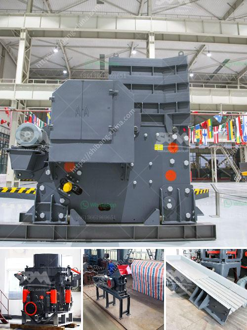

<h3>50 tpd iron crusher machinery cost</h3>
The iron industry plays a crucial role in the global economy, being essential for the production of steel, a key material used in countless industries. Iron ore is mined, processed, and transformed into usable products in various stages, with crushers being a fundamental piece of machinery in the process.

One such crusher machinery that has gained immense popularity in the industry is the 50 tpd iron crusher. This efficient and powerful machinery is designed to crush iron ore into smaller pieces, allowing for easier processing and transportation. But what are the costs associated with such machinery?

The cost of a 50 tpd iron crusher machinery can vary depending on various factors, including its manufacturing quality, design, and capabilities. However, on average, these crushers can range from $15,000 to $50,000. It is important to note that the cost may also vary based on the specific specifications required by the customer.

While the initial investment may seem significant, it is crucial to consider the long-term benefits and cost savings associated with such machinery. A 50 tpd iron crusher is designed to withstand heavy-duty usage and can efficiently process large quantities of iron ore. This can lead to increased productivity, reduced downtime, and significant cost savings in the long run.

Moreover, the quality of the machinery plays a crucial role in determining its cost. Investing in a high-quality crusher can minimize maintenance and repair costs, ensuring a smooth and reliable operation for years to come. This can result in improved efficiency, reduced operating expenses, and ultimately, higher profitability.

Additionally, the 50 tpd iron crusher machinery offers versatility and flexibility, accommodating various types of iron ore and varying feed sizes. This adaptability translates into cost savings as it eliminates the need for multiple crushers to handle different materials, reducing both initial investment and operational costs.

In conclusion, the cost of a 50 tpd iron crusher machinery may vary between $15,000 to $50,000, depending on its specifications and quality. However, this initial investment can lead to substantial long-term cost savings, increased productivity, and improved efficiency. Investing in a high-quality crusher ensures durability, reduced maintenance costs, and enhanced profitability in the iron industry.
<h3>Contact us</h3><ul><li><strong>Whatsapp:&nbsp;<a href="https://wa.me/8613661969651">+8613661969651</a></strong></li><li><a href="https://swt.shibang-china.com/?git&amp;zhl&amp;50 tpd iron crusher machinery cost"><strong>Online Service(chat now)</strong></a></li></ul><h3>Related</h3><ul><li><a href='find fine jaw crusher in china.md'>find fine jaw crusher in china</a></li><li><a href='different crushed stones in nigeria.md'>different crushed stones in nigeria</a></li><li><a href='machines for quarrying of stones.md'>machines for quarrying of stones</a></li><li><a href='chaines talc granding company in malaysia.md'>chaines talc granding company in malaysia</a></li><li><a href='stone crusher hammer crusher.md'>stone crusher hammer crusher</a></li></ul>