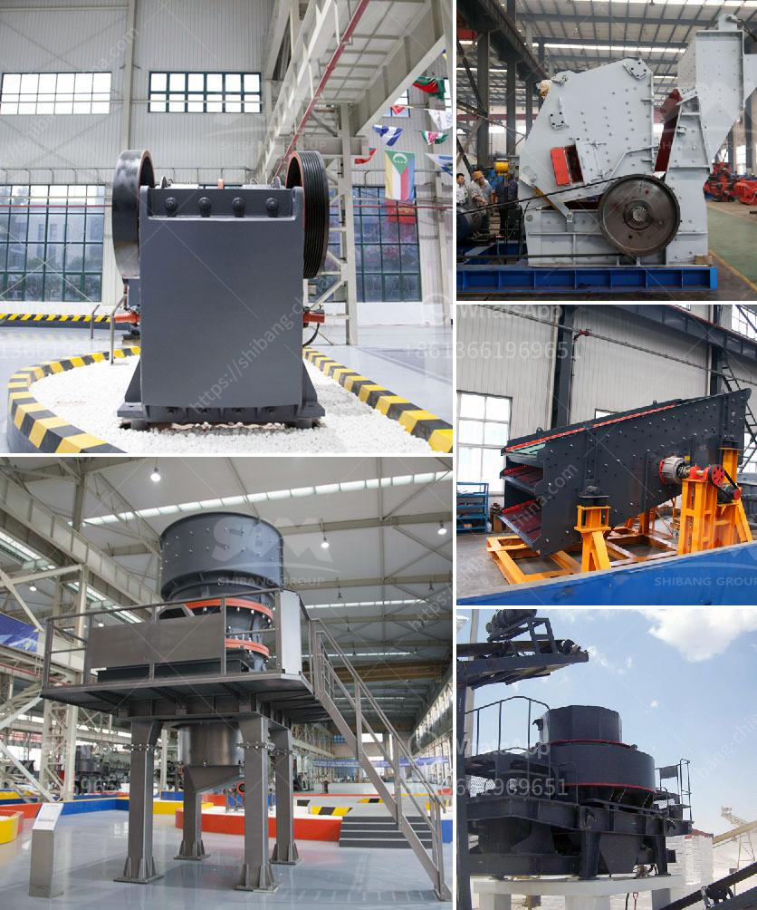

<h3>50 tph stone crusher price</h3>
50 tph stone crusher is widely used in mining, building materials, chemical industry, metallurgy and so on. The cost of 50 tph stone crusher can vary greatly depending on many factors such as the type and size of the machine along with the desired output size. It is important to note that many factors contribute to the crushing cost, including fuel consumption, labor costs, maintenance costs, and plant throughput.

One of the key factors that will determine the price of the stone crusher is the production capacity. Typically, the capacity range of these machines can be from 20 tph to 50 tph. There are small stone crushers with a capacity of 5-15 tph and larger ones with a capacity of 200-500 tph. It all depends on the needs and requirements of the customer.

Another factor that may affect the price is the type of machine. There are stationary, portable, and mobile stone crushers available in the market. Each has its own advantages and disadvantages. Stationary crushers are more durable and sturdy, but they are not easily transportable. Portable crushers, on the other hand, can be moved easily from one site to another. Mobile crushers offer the highest flexibility and convenience as they can be operated from the comfort of an operator's cabin.

In addition to these factors, the output size and gradation requirements will also impact the price of the stone crusher. Different industries have different requirements for the size and shape of the final product. Stone crushers with adjustable output size can be more expensive due to the additional machinery and equipment required to achieve the desired results.

In conclusion, the price of a 50 tph stone crusher is affected by various factors, such as the production capacity, type of machine, and output size requirements. These factors should be taken into consideration when choosing a stone crusher to meet your specific needs and budget.
<h3>Contact us</h3><ul><li><strong>Whatsapp:&nbsp;<a href="https://wa.me/8613661969651">+8613661969651</a></strong></li><li><a href="https://swt.shibang-china.com/?git&amp;zhl&amp;50 tph stone crusher price"><strong>Online Service(chat now)</strong></a></li></ul><h3>Related</h3><ul><li><a href='impact crushers saudi.md'>impact crushers saudi</a></li><li><a href='barite ore processing in morocco.md'>barite ore processing in morocco</a></li><li><a href='ton per day crusher barmac.md'>ton per day crusher barmac</a></li><li><a href='ultra fine grinder advantages.md'>ultra fine grinder advantages</a></li><li><a href='company selling stone crusher in kenya.md'>company selling stone crusher in kenya</a></li></ul>