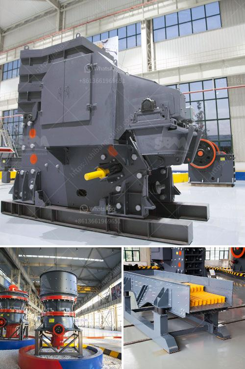

<h3>50tpd cement plant cost in india</h3>
Investing in a cement plant offers a great opportunity for entrepreneurs looking to capitalize on the growing demand for cement in India. With the country's rapid urbanization and infrastructure development, the cement industry is projected to witness a significant boost in the coming years. In this article, we will discuss the approximate cost of setting up a 50tpd cement plant in India.

A 50tpd (tonnes per day) cement plant is a relatively small cement manufacturing capacity. Usually, such small-scale plants are based on the rotary kiln technology, which is considered old but still effective in terms of production output and cost efficiency.

The cost of setting up a 50tpd cement plant in India can vary from around 8 crore to 15 crore INR, depending on the location, size, and other factors. Specific cost estimates can be obtained by contacting cement plant manufacturers and suppliers in India. However, we can provide a general breakdown of the major expenses involved in setting up such a plant.

1. Land and Site Development: Acquiring land for the plant is the first major expense. The cost of land can vary significantly depending on the location and accessibility. Additionally, site development expenses, such as leveling the land, constructing roads, and installing basic infrastructure, also need to be considered.

2. Plant and Machinery: The machinery required for a 50tpd cement plant includes a rotary kiln, cement mill, conveyor belts, storage silos, and other auxiliary equipment. The cost can vary depending on the quality and capacity of the machinery. It is crucial to select reliable suppliers and manufacturers to ensure the efficiency and durability of the equipment.

3. Raw Materials and Fuel: Cement production requires raw materials such as limestone, clay, and gypsum. The availability of these materials near the plant site can significantly impact the cost. Furthermore, the cost of fuel, mainly coal or petcoke, for the kiln also needs to be considered.

4. Manpower and Labor: Running a cement plant requires a skilled workforce. The number of employees required for a 50tpd plant can vary depending on the level of automation and production capacity. Labor costs, including wages, social security, and benefits, need to be factored in.

5. Utilities: Power and water are crucial utilities required for the operation of a cement plant. The cost of electricity and water supply can vary depending on the location and accessibility. Plant owners should consider investing in renewable energy sources to reduce long-term operational costs.

6. Statutory and Regulatory Compliance: Setting up a cement plant requires obtaining various permits, licenses, and clearances from local authorities and government agencies. Engaging professional consultants to handle the legal and regulatory aspects is advisable to ensure compliance and avoid any delays or penalties.

It is important to note that the cost mentioned above is an approximate estimate and can vary based on market conditions and specific project requirements. Additionally, owners should consider a contingency fund to account for unforeseen expenses that may arise during the construction and commissioning phases.

In conclusion, setting up a 50tpd cement plant in India can be a profitable venture given the country's robust demand for cement. However, entrepreneurs should conduct thorough market research, engage competent suppliers, and develop a comprehensive business plan to ensure the success of their venture.
<h3>Contact us</h3><ul><li><strong>Whatsapp:&nbsp;<a href="https://wa.me/8613661969651">+8613661969651</a></strong></li><li><a href="https://swt.shibang-china.com/?git&amp;zhl&amp;50tpd cement plant cost in india"><strong>Online Service(chat now)</strong></a></li></ul><h3>Related</h3><ul><li><a href='indonesia vertical grinding machine.md'>indonesia vertical grinding machine</a></li><li><a href='300 tph cone crusher price.md'>300 tph cone crusher price</a></li><li><a href='process flow of bajri washing plant.md'>process flow of bajri washing plant</a></li><li><a href='industrial limestone impact crushers.md'>industrial limestone impact crushers</a></li><li><a href='crusher in pakistan.md'>crusher in pakistan</a></li></ul>