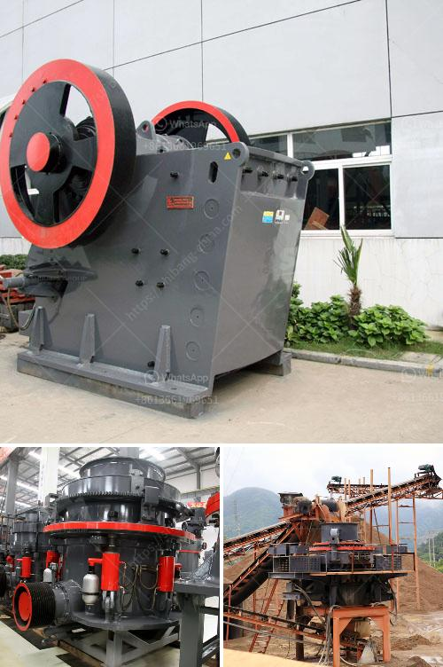

<h3>50tpd mini cement plant cost in india</h3>
The cement industry is a vital part of the Indian economy, employing over a million people directly or indirectly. The demand for cement in India is expected to grow significantly in the coming years, as the government plans to invest heavily in infrastructure development and housing projects. As a result, many small and medium-scale entrepreneurs are looking to set up mini cement plants in various parts of the country to cater to the growing demand.

A mini cement plant with a production capacity of 50 tons per day, or 50 tpd, can be set up at a relatively lower cost than larger scale cement plants. The cost of setting up a 50 tpd mini cement plant project can be around Rs. 35-40 lakhs, depending on the location, size of the plant, and the quality of machinery.

Moreover, the cost of land and building, civil works, machinery and equipment, electrical, and other infrastructure costs will also impact the overall cost. However, it is important to note that the actual cost can vary significantly depending on various factors, and entrepreneurs are advised to conduct a detailed feasibility study to determine the exact cost involved.

Setting up a mini cement plant can be a profitable venture due to its cost-effective nature and the increasing demand for cement in the country. The cement produced by mini plants is of high quality and can be used in various construction projects. It can also be sold in the local market, generating a steady income for the entrepreneur.

Additionally, the government provides various incentives and subsidies to promote the setting up of mini cement plants in India. These include lower interest rates on loans, tax benefits, and financial assistance for acquiring modern machinery and equipment.

In conclusion, setting up a 50 tpd mini cement plant in India can be a lucrative business opportunity for entrepreneurs, given the rising demand for cement in the country. However, it is essential to conduct a thorough feasibility study and determine the precise cost involved in order to ensure a successful venture. With the right planning and implementation, a mini cement plant can be a profitable venture in the Indian cement industry.
<h3>Contact us</h3><ul><li><strong>Whatsapp:&nbsp;<a href="https://wa.me/8613661969651">+8613661969651</a></strong></li><li><a href="https://swt.shibang-china.com/?git&amp;zhl&amp;50tpd mini cement plant cost in india"><strong>Online Service(chat now)</strong></a></li></ul><h3>Related</h3><ul><li><a href='crusher manufacturer in.md'>crusher manufacturer in</a></li><li><a href='sells hammer mills in zimbabwe.md'>sells hammer mills in zimbabwe</a></li><li><a href='turkish supplier for phosphate ball mill.md'>turkish supplier for phosphate ball mill</a></li><li><a href='ethiopia crusher jaw crusher.md'>ethiopia crusher jaw crusher</a></li><li><a href='crusher dust collection system oman.md'>crusher dust collection system oman</a></li></ul>