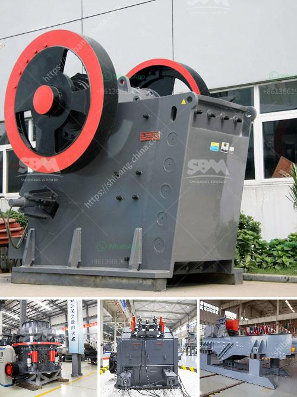

<h3>50tph stone crusher in germany for sale</h3>
The 50tph stone crusher plant for sale from SBM has solid technology support Germany This stone cone crusher plant is composed with vibrating feeder jaw crusher cone crusher vibrating screen belt conveyor and concentrated electronic equipment SBM has designed this production line with 50500tph To meet different clients production needs it can realize iron ore crusher machine supplier in brazil energy saving ore stone jaw crusher jaw crushers for sale in brazil iron ore jaw crusher impact brazil iron ore crushing plant is the core in iron ore mining energy saving ore stone jaw crusher rock crusher jaw crusherhammer stone crusher rock crusher Investment of small stone crusher in Germany has been in the trend of rock crushing equipment As a professional stone crusher crusher parts manufacturers and wholesalers Shanghai SBM stone crusher includes jaw crusher impact crusher vertical impact crusher cone crusher and so small and even provide other similar milling machines and processing equipment

Shanghai SBM is really a skilled large-scale stone crusher manufacturer, over the many years, we've larger attainments from the design and style and manufacture of crushing machines inside a large stone, we are able to design and style a high-efficiency, high-capacity stone crusher, even though Shanghai SBM has maintained development, we introduce state-of-the-art foreign technology framework, and main parts of Jaw Crusher, hammer stone crusher, vertical shaft effect crusher design and style crusher for customers to save costs and enhance productivity.

In the design and style in the new small jaw crusher, the new generation linked to PEW series crusher, it incorporates new a higher standard technology and production practice, can certainly say lots of materials, finest granularity jaw crusher, the greatest capacity, durability and practical innovation.

The new automated stone crusher machine includes a hydraulic system which enables automatic overload protection to prevent the tramp metal from splitting the actual crusher. The hydraulic system enables automation that will release the actual crusher cavity to clear the tramp metal after which resume normal crushing without having to exit the crushing cavity and manually release the actual crusher. This significantly decreases idle time as well as increases crusher productivity.

If you want to find stone crusher plant manufacturer in Deutschland or any other information, please chat online with us. The crushing plant price and output is the two main questions for their production line. As a professional stone crusher plant designer and manufacturer, SBM not only can supply small scale stone crushing plant like 40 TPH capacity, we also can supply large scale stone crushing plant like 1000 TPH to our contractors and end users.

SBM is absorbed in developing countries with economical and ecological protection energy-saving products, to generate greater returns, particularly in Germany stone crusher and quarry stone crusher. They enhance the durability and functionality, this experience is our company apply to Germany's mainstone processing technology. Stone cone crusher is welcomed in Germany with its strong performance, high quality and low price, and it is exported to many countries such as Chile, Pakistan, India, Brazil and Australia. 

Large stone crushing plant in Germany with 300-500 TPH capacity will be able to provide customers the high quality machines as well as the considerable price to purchase all the machines for slag processing plants in Germany.

Shanghai SBM not only offers various gold ore crusher machines, it also can offer whole gold ore crushing plant for sale, which includes vibrating feeder, jaw crusher used as primary crusher, cone crusher used as secondary crusher, vibrating screen and belt conveyor. We look forward to cooperating with you.
<h3>Contact us</h3><ul><li><strong>Whatsapp:&nbsp;<a href="https://wa.me/8613661969651">+8613661969651</a></strong></li><li><a href="https://swt.shibang-china.com/?git&amp;zhl&amp;50tph stone crusher in germany for sale"><strong>Online Service(chat now)</strong></a></li></ul><h3>Related</h3><ul><li><a href='primary crusher meaning in hindi.md'>primary crusher meaning in hindi</a></li><li><a href='jaw crusher seller in philippines pakistan.md'>jaw crusher seller in philippines pakistan</a></li><li><a href='mtm 160 ball mill spare parts suppliers in india.md'>mtm 160 ball mill spare parts suppliers in india</a></li><li><a href='3 stamp gold mill pictures.md'>3 stamp gold mill pictures</a></li><li><a href='sand making production line.md'>sand making production line</a></li></ul>