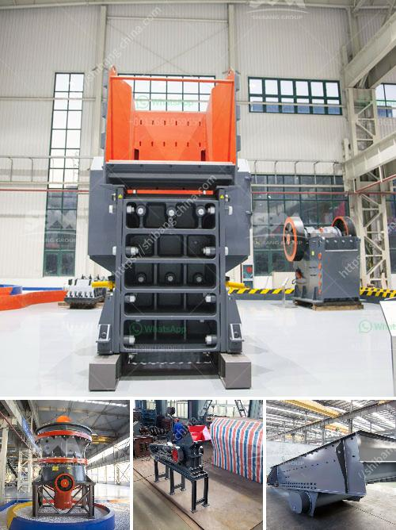

<h3>550 used cone crusher for sale</h3>
Are you in the market for a reliable and high-quality used cone crusher? Look no further than the 550 used cone crusher for sale. This powerful machine is perfect for crushing a variety of materials, including ores, rock, and gravel. With its compact size and efficient design, the 550 cone crusher offers exceptional performance at a fraction of the cost of a brand-new model.

The 550 cone crusher is equipped with a robust and durable construction, ensuring that it can withstand even the toughest of materials and operating conditions. It features a large feed opening, allowing for easy and efficient feeding of the material into the crushing chamber. Additionally, this cone crusher is designed with a high crushing ratio, resulting in a uniform product size and a higher overall efficiency.

One of the standout features of the 550 cone crusher is its hydraulic system. This feature allows for easy adjustment of the crusher settings, ensuring optimal performance and maximum productivity. Whether you need a fine or coarse crushing setting, the hydraulic system can quickly and accurately adjust the crusher to meet your specific requirements. This not only saves time but also ensures that you achieve the desired end product.

Another advantage of the 550 cone crusher is its versatility. This machine can be used for a wide range of applications, making it a valuable asset for various industries. Whether you are involved in mining, construction, or aggregate production, this cone crusher can handle it all. It can easily crush hard and abrasive materials, making it perfect for processing ores and rocks.

Additionally, the 550 cone crusher is designed with ease of maintenance in mind. It features a simple and user-friendly design, allowing for quick and easy access to all the necessary components. This means that routine maintenance tasks, such as changing the liners or inspecting the crusher, can be completed efficiently, maximizing uptime and minimizing downtime.

When it comes to purchasing a used cone crusher, reliability is key. The 550 cone crusher is known for its robust construction and high-quality components, making it a reliable and long-lasting machine. Additionally, all used cone crushers undergo thorough inspections and maintenance to ensure that they are in optimal working condition before being sold. This ensures that you can rely on the 550 cone crusher to deliver consistent performance and durability.

In conclusion, the 550 used cone crusher for sale is a reliable and high-quality machine that offers exceptional performance at a fraction of the cost of a brand-new model. Its robust construction and versatile design make it suitable for a wide range of applications and materials, while its hydraulic system allows for easy and precise adjustment of the crusher settings. With ease of maintenance and long-lasting durability, the 550 cone crusher is a smart investment for any industry. Don't miss out on the opportunity to own this exceptional machine today!
<h3>Contact us</h3><ul><li><strong>Whatsapp:&nbsp;<a href="https://wa.me/8613661969651">+8613661969651</a></strong></li><li><a href="https://swt.shibang-china.com/?git&amp;zhl&amp;550 used cone crusher for sale"><strong>Online Service(chat now)</strong></a></li></ul><h3>Related</h3><ul><li><a href='limestone ball mill in egypt.md'>limestone ball mill in egypt</a></li><li><a href='grinding of limestone for cement production.md'>grinding of limestone for cement production</a></li><li><a href='dorries vertical grinders used for sale europe.md'>dorries vertical grinders used for sale europe</a></li><li><a href='company selling stone crusher in kenya.md'>company selling stone crusher in kenya</a></li><li><a href='tanzania medical equipment supplier.md'>tanzania medical equipment supplier</a></li></ul>