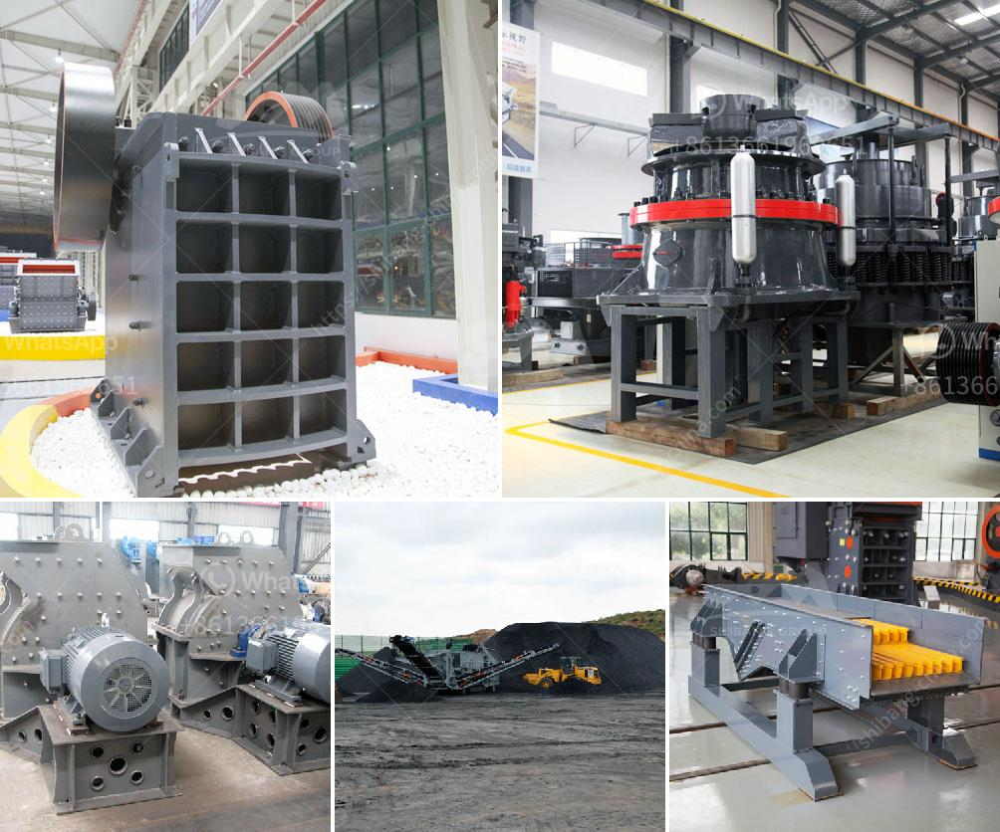

<h3>5kg grinding ball mill</h3>
A grinding ball mill is a type of grinder used to grind and blend materials for use in various industries. To produce fine powders, the grinding ball mill is equipped with ceramic or rubber linings for effective grinding. It features a cylindrical shell rotating about its axis and partially filled with grinding media such as ceramic balls, pebbles, or stainless steel balls.

One popular type of grinding ball mill is the 5kg grinding ball mill, which is designed for laboratory use. It is equipped with a powerful motor that allows rotation of the mill at various speeds, enabling efficient grinding of different materials. With a capacity of 5kg, this ball mill is ideal for small-scale experiments and research purposes.

The 5kg grinding ball mill is commonly used in industries such as metallurgy, mining, chemical, cement, construction, refractory materials, and ceramics. It can grind materials of various hardness levels, ranging from fragile to semi-hard materials. The grinding process is carried out by the impact and friction between the grinding media and the material being ground. This results in the reduction of particle size and the production of fine powders.

The 5kg grinding ball mill offers several advantages over other types of mills. Its compact size makes it easy to transport and handle. It is also user-friendly, with simple operation and maintenance. The ability to control the rotation speed allows for customizable grinding conditions, enabling researchers to optimize the grinding process for their specific needs.

In conclusion, the 5kg grinding ball mill is a versatile and efficient tool for grinding and blending materials in various industries. Its compact design, powerful motor, and customizable grinding conditions make it suitable for laboratory use in small-scale experiments and research. Whether for metallurgy, mining, chemical, or ceramic applications, this grinding ball mill is an indispensable tool for achieving fine powders and optimizing process parameters.
<h3>Contact us</h3><ul><li><strong>Whatsapp:&nbsp;<a href="https://wa.me/8613661969651">+8613661969651</a></strong></li><li><a href="https://swt.shibang-china.com/?git&amp;zhl&amp;5kg grinding ball mill"><strong>Online Service(chat now)</strong></a></li></ul><h3>Related</h3><ul><li><a href='milling and grinding machine.md'>milling and grinding machine</a></li><li><a href='gold hammer mill used for sale in zimbabwe.md'>gold hammer mill used for sale in zimbabwe</a></li><li><a href='stone crusher machine malaysia.md'>stone crusher machine malaysia</a></li><li><a href='lime stone grinder mill.md'>lime stone grinder mill</a></li><li><a href='sand wash plants for sale in texas.md'>sand wash plants for sale in texas</a></li></ul>