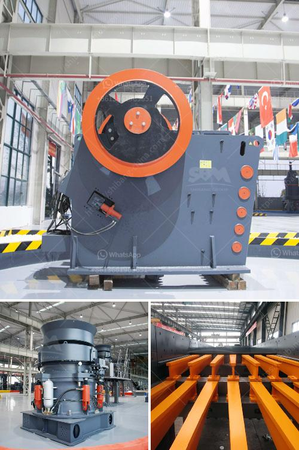

<h3>700t h mobile crusher</h3>
The 700t/h mobile crusher, also known as the mobile crushing station, is a durable and high-efficiency crushing machine introduced by our company. Combined with the various types of screens, mobile crushing and screening plant, which are made up of vibrating screens, crusher machines, belt conveyor and dust collector etc., has the advantages of high flexibility, which can be tailored to customers' requirements.

The 700t/h mobile crusher not only is economical and flexible, but also has outstanding mobility and excellent performance in terms of mobility, processing capacity, and environmental protection. It can be widely used in various industries such as mining, construction waste recycling, building aggregate production, and municipal solid waste disposal.

With a maximum feeding size of 930mm and a capacity of 700t/h, it is capable of crushing large-sized materials delivered from the quarry directly into the required products. Equipped with an onboard diesel generator, it can be operated independently even in remote areas without access to electricity.

In addition to its high performance, the 700t/h mobile crusher is designed with safety and convenience in mind. The machine is equipped with a wireless remote control, allowing operators to easily move and control the crushing operations from a safe distance. It also has a user-friendly interface and automatic control system, ensuring smooth and efficient operation. Furthermore, it is designed with a dust suppression system to minimize dust emissions and protect the environment.

Overall, the 700t/h mobile crusher is a reliable and efficient crushing solution in various industries. Its high mobility, flexibility, and environmentally-friendly features make it an ideal choice for both small and large-scale projects. Whether it is for crushing hard rocks, recycling construction waste, or producing high-quality aggregates, this mobile crusher can meet the demands of customers with its exceptional performance and versatility.
<h3>Contact us</h3><ul><li><strong>Whatsapp:&nbsp;<a href="https://wa.me/8613661969651">+8613661969651</a></strong></li><li><a href="https://swt.shibang-china.com/?git&amp;zhl&amp;700t h mobile crusher"><strong>Online Service(chat now)</strong></a></li></ul><h3>Related</h3><ul><li><a href='stone quarrying process.md'>stone quarrying process</a></li><li><a href='mining equipment and hire zimbabwe.md'>mining equipment and hire zimbabwe</a></li><li><a href='granite processing plant prices.md'>granite processing plant prices</a></li><li><a href='rock gypsum buyers in china.md'>rock gypsum buyers in china</a></li><li><a href='stone crusher saudi.md'>stone crusher saudi</a></li></ul>