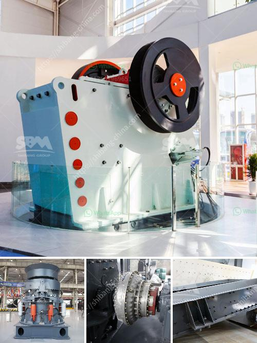

<h3>advantages of jaw crushers</h3>
Jaw crushers are used primarily for crushing hard and abrasive materials such as granite, basalt, gravel, limestone, and rock. They are manufactured with larger motor power and higher crushing ratios compared to their counterparts, providing a stronger and more efficient crushing process in the mining industry.

One of the main advantages of a jaw crusher is its ability to process natural rock and rubble into a smaller size, reducing landfill and disposal costs. This economic benefit can be further enhanced by processing these materials for additional uses, such as aggregates for concrete and asphalt production. By recycling demolition waste, jaw crushers help to preserve natural resources and contribute to a sustainable environment.

Another advantage of jaw crushers is their versatility. They can be used in various applications, ranging from the primary crushing of large-sized materials to secondary and tertiary crushing of smaller and more manageable particles. This versatility allows for the production of different types and sizes of aggregates, meeting various project requirements. Additionally, jaw crushers can be equipped with additional features such as a vibrating feeder or a grizzly screen, which can improve the efficiency of the crushing process by removing oversized materials and preventing clogging.

Furthermore, jaw crushers have a simple design, which ensures easy operation and maintenance. This simplicity translates into reduced downtime and lower maintenance costs, making jaw crushers a cost-effective option for crushing operations. Additionally, their robust construction ensures durability and longevity, minimizing the need for frequent replacements and repairs. The availability of spare parts also contributes to the ease of maintenance, ensuring that the crusher remains operational for extended periods of time.

In terms of energy efficiency, jaw crushers are known to consume less power compared to other types of crushers, such as cone crushers and impact crushers. This reduced energy consumption translates into lower fuel costs, making jaw crushers a more economical choice, especially for large-scale crushing operations.

Safety is another advantage of jaw crushers. These machines are equipped with safety features such as a toggle plate, which protects the crusher from damage in cases of uncrushable materials, ensuring the safety of both the operator and the machine. Additionally, jaw crushers are equipped with a hydraulic system that allows for easy and safe adjustments of the crusher settings, ensuring optimal productivity and efficiency.

To sum up, jaw crushers offer numerous advantages for the mining industry. Their ability to process hard and abrasive materials, their versatility, simplicity, energy efficiency, and safety features make them a reliable and cost-effective option for crushing operations. Whether used in primary, secondary, or tertiary crushing stages, jaw crushers are essential equipment for the production of high-quality aggregates and the recycling of demolition waste, contributing to a sustainable and eco-friendly mining industry.
<h3>Contact us</h3><ul><li><strong>Whatsapp:&nbsp;<a href="https://wa.me/8613661969651">+8613661969651</a></strong></li><li><a href="https://swt.shibang-china.com/?git&amp;zhl&amp;advantages of jaw crushers"><strong>Online Service(chat now)</strong></a></li></ul><h3>Related</h3><ul><li><a href='200 ton crusher price.md'>200 ton crusher price</a></li><li><a href='calcium carbonate powder making equipment in germany.md'>calcium carbonate powder making equipment in germany</a></li><li><a href='jaw crusher in uzbekistan.md'>jaw crusher in uzbekistan</a></li><li><a href='crushing milling machine for graphite powder.md'>crushing milling machine for graphite powder</a></li><li><a href='stone crusher machines from denmark.md'>stone crusher machines from denmark</a></li></ul>