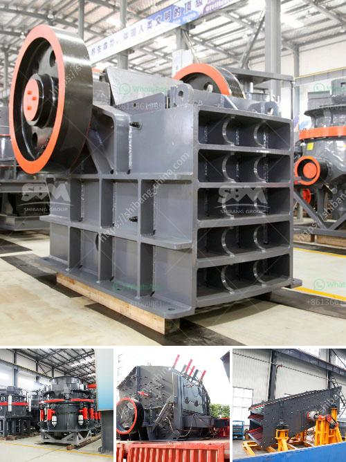

<h3>aggregate crusher plant keesara</h3>
The construction industry constantly demands better and more efficient equipment to facilitate smooth operations. One such revolutionary machine that has been paving the way in the construction world is the aggregate crusher plant in Keesara. This plant, located in the outskirts of Hyderabad, has been a game changer, making the process of crushing and screening of aggregates faster and more efficient.

The aggregate crusher plant in Keesara boasts state-of-the-art machinery to enhance the crushing process. The equipment utilized is technologically advanced and features a high level of automation, ensuring optimum productivity and reducing downtime. With these cutting-edge machines, the plant can handle a wide range of materials, including sand, gravel, crushed stone, and recycled concrete.

The efficiency and reliability of the aggregate crusher plant in Keesara are some of its standout features. The plant has a well-designed layout that allows for ease of operation and maintenance. Its high capacity crushing chambers ensure that large volumes of materials can be processed quickly, maximizing output and reducing cycle times.

Environmental sustainability is also a key aspect of the aggregate crusher plant in Keesara. The plant is equipped with advanced dust control systems, ensuring minimal dust emissions and promoting a healthier work environment. Additionally, its energy-efficient design helps in reducing the carbon footprint, making it an environmentally friendly choice.

Another significant advantage of the aggregate crusher plant in Keesara is its mobility. The plant can be easily moved around various construction sites, eliminating the need for multiple crushers and reducing transportation costs. This flexibility enables contractors to complete projects faster, meeting tight deadlines and staying within budget.

The aggregate produced from the plant is of exceptionally high quality, meeting all relevant industry standards. This ensures that the final construction materials used are durable and long-lasting, giving structures the strength they need to withstand harsh weather conditions and heavy usage.

In conclusion, the aggregate crusher plant in Keesara has proven to be a game changer in the construction industry. With its advanced technology, high capacity, and mobility, it offers numerous benefits for contractors, making their operations more efficient and cost-effective. Furthermore, its commitment to environmental sustainability sets a new standard for the industry. The plant's contribution to the development of infrastructure is invaluable, making it an indispensable asset for any construction project.
<h3>Contact us</h3><ul><li><strong>Whatsapp:&nbsp;<a href="https://wa.me/8613661969651">+8613661969651</a></strong></li><li><a href="https://swt.shibang-china.com/?git&amp;zhl&amp;aggregate crusher plant keesara"><strong>Online Service(chat now)</strong></a></li></ul><h3>Related</h3><ul><li><a href='stone powder raymond machine price.md'>stone powder raymond machine price</a></li><li><a href='aggregates crushers for sale.md'>aggregates crushers for sale</a></li><li><a href='100 tph stone crushers with vsi in india.md'>100 tph stone crushers with vsi in india</a></li><li><a href='cone crusher calculation.md'>cone crusher calculation</a></li><li><a href='jaw crusher 10 x 36 sulit.md'>jaw crusher 10 x 36 sulit</a></li></ul>