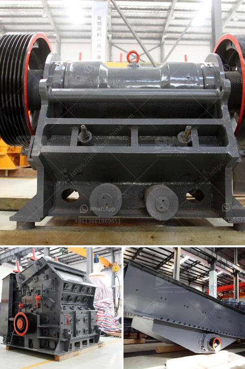

<h3>aggregate crusher production equipment</h3>
In the quarrying, mining, and aggregate industries, crushing is the first and crucial step to produce the raw materials necessary for further processing. Crushing devices hold the material firmly in place and break it into smaller fragments, reducing its size for easier handling and efficient transportation. This process significantly enhances the overall production and economic value of the materials.

Aggregate crusher production equipment mainly relies on primary or secondary crushing operations. Various types of crushers can perform this task including hammer mills, roller crushers, jaw crushers, and gyratory crushers. An aggregate crusher can be relatively small, like the mobile units used for reclaiming recycled asphalt, or huge machines that can process thousands of tons of material a day.

Hammer mills are machines with a rotating shaft that is fitted with free-swinging hammers. This assembly is enclosed by a drum and fed by a hopper. A screen prevents oversized material from escaping the crushing chamber. The whole system is powered by a diesel engine or other power source.

Roll crushers are compact units that consist of two counter-rotating rollers. These machines are typically used in aggregate production, where reduced fines production is required. The allowable feed size is up to 1200 mm, with a product size of 80 mm or less.

Jaw crushers are the most commonly used aggregate crushers for large-scale mining or quarrying operations. These machines are designed to handle large rocks, ores, and stones. The jaw crushers consist of a fixed jaw mounted in a V-shaped alignment, while the movable jaw exerts force on the rocks by pressing them against the stationary plate. The output size can be adjusted by changing the gap between the jaws.

Gyratory crushers are used in mine or ore processing plants and are designed to be more efficient than jaw crushers. The primary gyratory crushers operate in open circuit, while the secondary gyratory crushers operate in closed circuit.

In conclusion, aggregate crusher production equipment plays a crucial role in enhancing the overall efficiency and effectiveness of the whole crushing process. Whether portable or stationary, crushers play a key role in breaking down the large rocks and transforming them into smaller, more manageable sizes. Invest in high-quality machinery to maximize productivity and ensure the long-term success of your business.
<h3>Contact us</h3><ul><li><strong>Whatsapp:&nbsp;<a href="https://wa.me/8613661969651">+8613661969651</a></strong></li><li><a href="https://swt.shibang-china.com/?git&amp;zhl&amp;aggregate crusher production equipment"><strong>Online Service(chat now)</strong></a></li></ul><h3>Related</h3><ul><li><a href='rock crusher mill.md'>rock crusher mill</a></li><li><a href='quartz manufacturing plant in india.md'>quartz manufacturing plant in india</a></li><li><a href='gold refining machine capacity 2 tons per day.md'>gold refining machine capacity 2 tons per day</a></li><li><a href='grinding size of bentonite crusher.md'>grinding size of bentonite crusher</a></li><li><a href='project cost to manufacture 200 tpd cement in in nepal.md'>project cost to manufacture 200 tpd cement in in nepal</a></li></ul>