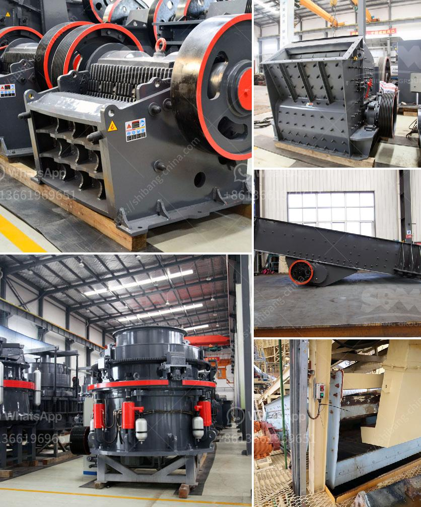

<h3>aggregate crusher production</h3>
Aggregate crushing can be traced back to the ancient Egyptians who used sand and gravel to build their roads and structures. Egyptians would use crude tools made of stone, clay, and wood to crush and sieve the material to obtain the desired sizes.

Aggregate production came into existence with the invention of modern mining equipment, enabling efficient production of crushed stones and manufactured sand, resulting in better quality roads, buildings, and structures. Today, aggregate crusher production is a vital aspect of modern mining operations, as it provides the materials essential for creating the infrastructure we rely on daily.

Aggregate production involves several stages, starting with blasting and excavation. Blasting techniques loosen the desired rocks from the earth, enabling easier extraction. Excavators and loaders then transport the excavated material to a primary crusher for initial processing.

The primary crusher, usually a jaw or gyratory crusher, breaks the excavated rocks into smaller sizes. This initial processing helps remove larger boulders and rubbles, ensuring a more uniform feed for secondary and tertiary crushers.

The secondary and tertiary crushers further reduce the size of the rock into the desired aggregate sizes. Cone crushers are commonly used in secondary and tertiary crushing stages due to their ability to provide a high reduction ratio and fine particle shape.

After the rock has been crushed to the desired sizes, it goes through screening processes to separate the different sizes of aggregates. Screening equipment, such as vibrating screens or inclined screens, helps ensure the final aggregate product meets the required specifications.

The final step in aggregate production is stockpiling the crushed material. Properly sized aggregate products are stored in large piles or bins to be delivered to various construction sites or used for processing other construction materials, such as asphalt or concrete.

Aggregate production is a highly regulated industry, adhering to strict quality control measures. Testing procedures, including sieve analysis, specific gravity, and particle shape analysis, ensure that the produced aggregates meet the required specifications for strength, durability, and gradation.

Aggregate crusher production plays a crucial role in various construction projects, from road and building construction to railway ballast and concrete production. The demand for aggregates is continuously increasing due to urbanization and infrastructure development, making the aggregate production industry a vital component of the economy.

Advancements in crushing technology and equipment have significantly improved the efficiency and effectiveness of aggregate production. Modern crushers are designed to optimize crushing processes, reducing energy consumption and minimizing wear and tear on the machinery.

Additionally, the use of mobile crushers allows for on-site crushing, eliminating the need for transporting raw materials to a centralized crushing facility. This not only reduces transportation costs but also minimizes environmental impact by reducing carbon emissions associated with transportation.

In conclusion, aggregate crusher production is an essential element in modern mining operations and construction projects. It plays a crucial role in providing materials necessary for infrastructure development, ensuring the construction of durable roads, buildings, and structures. With continuous advancements in technology, the aggregate production industry is poised to further optimize operations in the future.
<h3>Contact us</h3><ul><li><strong>Whatsapp:&nbsp;<a href="https://wa.me/8613661969651">+8613661969651</a></strong></li><li><a href="https://swt.shibang-china.com/?git&amp;zhl&amp;aggregate crusher production"><strong>Online Service(chat now)</strong></a></li></ul><h3>Related</h3><ul><li><a href='concrete crushing companies in nigeria.md'>concrete crushing companies in nigeria</a></li><li><a href='jaw crushers china.md'>jaw crushers china</a></li><li><a href='300tph ball mill manufacturer in philippines.md'>300tph ball mill manufacturer in philippines</a></li><li><a href='gold hammer mill used for sale in zimbabwe.md'>gold hammer mill used for sale in zimbabwe</a></li><li><a href='ball mill for sale.md'>ball mill for sale</a></li></ul>