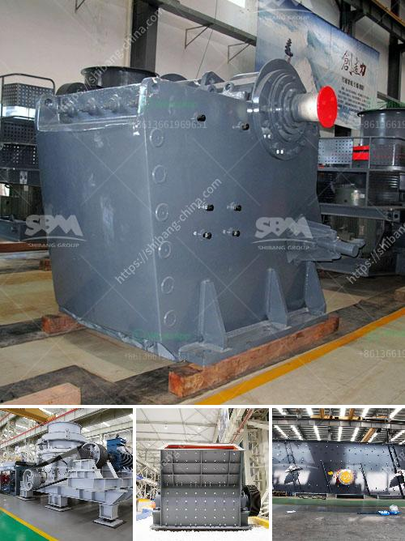

<h3>aggregate crushers for sale</h3>
Aggregate crushers are machines used in the mining industry to crush large rocks and ores into smaller pieces. These machines are designed to process a wide range of materials such as limestone, granite, and other types of stones. With the increasing demand for aggregates in construction projects, the market for aggregate crushers for sale is growing rapidly.

One of the key features of aggregate crushers is their ability to handle large rocks. These machines are equipped with powerful motors that can generate a high amount of crushing force. The rocks are fed into the crusher through a hopper, and as they move towards the crushing chamber, they encounter the rotating hammers or jaws that crush them into smaller pieces. The crushed stones are then discharged through a discharge chute or conveyor belt.

There are different types of aggregate crushers available in the market. Jaw crushers, cone crushers, impact crushers, and hammer crushers are some of the commonly used crushers. Each type of crusher has its own unique features and advantages. For example, jaw crushers are ideal for primary crushing operations, while cone crushers are suitable for secondary and tertiary crushing.

When choosing an aggregate crusher for sale, it is important to consider factors such as the desired output size, capacity, and the level of automation. Some crushers come with advanced features such as hydraulic systems, which allow for easy adjustment of the discharge setting, and overload protection, which prevents damage to the crusher in case of an overload. These features enhance the efficiency and safety of the crusher.

Another important aspect to consider when buying an aggregate crusher is the maintenance and operational costs. Crushers with low maintenance requirements and low operational costs are more cost-effective in the long run. It is advisable to opt for crushers from reputable manufacturers who provide after-sales support and spare parts availability.

In addition to their primary function of crushing rocks, aggregate crushers can also be used in recycling applications. They can crush concrete and asphalt waste, turning them into reusable aggregates for use in new construction projects. This not only reduces the environmental impact of waste disposal but also helps conserve natural resources.

The market for aggregate crushers for sale is highly competitive, with various manufacturers and suppliers offering a wide range of products. To find the best crushers at competitive prices, it is advisable to compare different options and consider factors such as the reputation of the manufacturer, the quality of the product, and the after-sales support provided.

In conclusion, aggregate crushers play a crucial role in the mining industry by crushing large rocks and ores into smaller pieces. They are essential for the production of aggregates used in construction projects. When buying an aggregate crusher, it is important to consider factors such as the desired output size, capacity, maintenance requirements, and operational costs. By making an informed decision, buyers can find the best crushers at competitive prices to meet their specific needs.
<h3>Contact us</h3><ul><li><strong>Whatsapp:&nbsp;<a href="https://wa.me/8613661969651">+8613661969651</a></strong></li><li><a href="https://swt.shibang-china.com/?git&amp;zhl&amp;aggregate crushers for sale"><strong>Online Service(chat now)</strong></a></li></ul><h3>Related</h3><ul><li><a href='start a stone crusher.md'>start a stone crusher</a></li><li><a href='cement clinker manufacturing machine.md'>cement clinker manufacturing machine</a></li><li><a href='new hammer mill pricing.md'>new hammer mill pricing</a></li><li><a href='grinding machine its operation principle.md'>grinding machine its operation principle</a></li><li><a href='stone crusher plant supplier.md'>stone crusher plant supplier</a></li></ul>