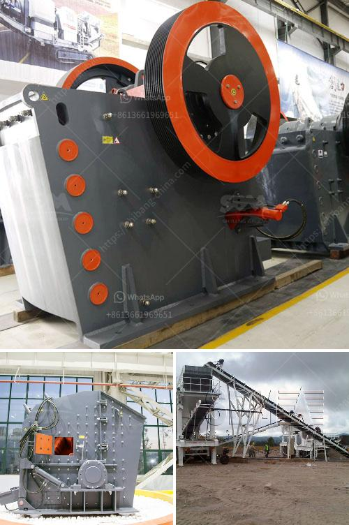

<h3>aggregate crushing plant price</h3>
When it comes to purchasing an aggregate crushing plant, the price plays a crucial role in your decision. However, finding the right plant at an affordable price can be challenging. This is why it is essential to compare different options and consider various factors before making your final purchase. In this article, we will discuss the key aspects of aggregate crushing plant price and how you can get the best value for your investment.

The price of an aggregate crushing plant is determined by factors such as the capacity (tons per hour), the feed size, and the output size, along with the desired product quality and other performance parameters. These factors also determine the labor and maintenance costs of the plant, which must be considered when evaluating the overall price.

One way to determine the price range of an aggregate crushing plant is to compare multiple suppliers and their offerings. Start by researching different manufacturers and their range of products. Request price quotes from several suppliers, and analyze them carefully. Look beyond the initial purchase cost and consider the total cost of ownership over the lifetime of the plant. This includes maintenance, spare parts, and operational expenses. It is recommended to choose a supplier that offers reliable after-sales service and readily available spare parts.

Another factor that affects the price is the type and quality of the equipment used in the crushing plant. High-quality equipment tends to have a higher upfront cost but offers better performance, durability, and longevity. Investing in such equipment can result in lower maintenance and replacement costs in the long run. Therefore, it is crucial to carefully examine the specifications and features of each plant to make an informed decision.

Furthermore, the location and transportation costs also influence the price. If the crushing plant needs to be transported a long distance, the shipping costs can significantly impact the total price. Consider sourcing the plant from a local manufacturer or look for suppliers that offer competitive transportation rates.

Lastly, it is worth considering whether purchasing a new or used plant is more suitable for your needs. Used plants can often be found at a lower price, but they may come with higher maintenance and repair costs. On the other hand, new plants provide the advantage of modern technology, improved efficiency, and warranty coverage. Carefully evaluate your requirements and budget constraints to make the right decision.

In conclusion, finding the right price for an aggregate crushing plant requires careful consideration of various factors such as plant capacity, equipment quality, location, and transportation costs. Take the time to research multiple suppliers, compare their offerings, and analyze the total cost of ownership. By doing so, you can ensure that you get the best value for your investment while also meeting your specific crushing needs.
<h3>Contact us</h3><ul><li><strong>Whatsapp:&nbsp;<a href="https://wa.me/8613661969651">+8613661969651</a></strong></li><li><a href="https://swt.shibang-china.com/?git&amp;zhl&amp;aggregate crushing plant price"><strong>Online Service(chat now)</strong></a></li></ul><h3>Related</h3><ul><li><a href='turkish association marble machinery.md'>turkish association marble machinery</a></li><li><a href='rock crusher for granite.md'>rock crusher for granite</a></li><li><a href='vibrating machine for concrete.md'>vibrating machine for concrete</a></li><li><a href='malaysia ball mill.md'>malaysia ball mill</a></li><li><a href='open pit mobile crushing plant.md'>open pit mobile crushing plant</a></li></ul>