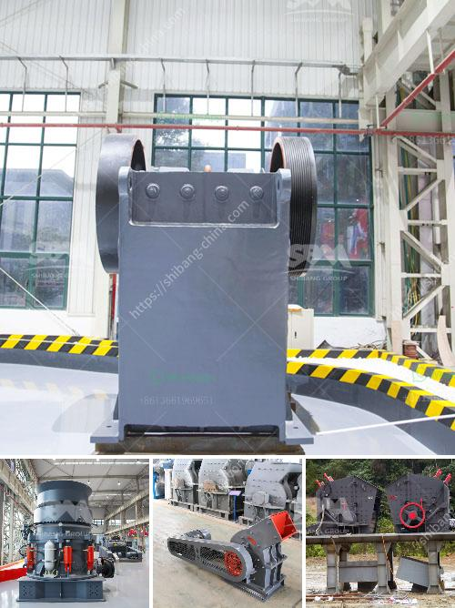

<h3>aggregate manufacturing process</h3>
Aggregate manufacturing process refers to the process of producing a mass quantity of materials such as sand, gravel, crushed stone, or recycled concrete, used mainly for construction purposes. This process involves a combination of extraction, crushing, and screening of raw materials to create aggregates of various sizes and shapes.

The first step in the aggregate manufacturing process is the extraction of raw materials from quarries or mines. This is typically done through blasting or drilling to access the desired rock or gravel deposits. Once the materials are extracted, they are loaded onto trucks and transported to the crushing plant.

In the crushing plant, the raw materials are crushed into smaller pieces using heavy machinery like jaw crushers, impact crushers, or cone crushers. This process helps to reduce the size of the materials to meet specific requirements for different construction applications. The crushed materials may then be further cleaned or washed to remove impurities such as clay or dust.

After the crushing process, the aggregates are sorted and screened based on their size and shape. This is essential to ensure that the final product meets the required specifications. Screening can be done using vibrating screens or other specialized equipment to separate the aggregates into different grades.

Once the aggregates are sorted and screened, they are ready to be used for various construction purposes. These include the production of concrete, asphalt, road base, or even as fill material for landscaping projects. The aggregates may be mixed with other materials to create specific blends with desired properties.

In conclusion, the aggregate manufacturing process is a crucial step in the construction industry. It involves the extraction, crushing, and screening of raw materials to produce aggregates that meet the required specifications for different construction applications. Proper manufacturing processes ensure the production of high-quality aggregates, which are essential for building strong and durable structures.
<h3>Contact us</h3><ul><li><strong>Whatsapp:&nbsp;<a href="https://wa.me/8613661969651">+8613661969651</a></strong></li><li><a href="https://swt.shibang-china.com/?git&amp;zhl&amp;aggregate manufacturing process"><strong>Online Service(chat now)</strong></a></li></ul><h3>Related</h3><ul><li><a href='granite processing plant prices.md'>granite processing plant prices</a></li><li><a href='used rock crushers for sale philippines.md'>used rock crushers for sale philippines</a></li><li><a href='iron ore concentrate plant tpa production.md'>iron ore concentrate plant tpa production</a></li><li><a href='gold crusher cost.md'>gold crusher cost</a></li><li><a href='mtm 160 ball mill spare parts suppliers in india.md'>mtm 160 ball mill spare parts suppliers in india</a></li></ul>