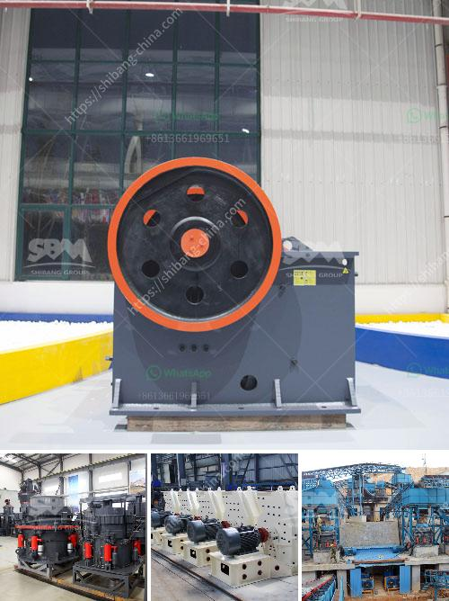

<h3>aggregate production process</h3>
Aggregate production is a fundamental process in the construction industry. It involves breaking down large rocks into smaller pieces and then mixing them with other materials to create various types of construction aggregates. These aggregates are crucial in the creation of roads, bridges, buildings, and other infrastructure that form the backbone of a modern society.

The aggregate production process begins with the extraction of raw materials from quarries and mines. These materials typically include limestone, granite, sand, and gravel. The process starts by blasting off large rocks from the quarry walls through explosives. These rocks are then loaded into trucks and transported to the crushing plant.

The first stage of the aggregate production process is the crushing of the extracted rock materials into smaller, more manageable sizes. This is typically done using jaw crushers or impact crushers. The jaw crusher is designed to crush large rocks into smaller pieces, while the impact crusher uses the principle of impact to reduce the size of the rocks.

Once the rocks are crushed, they are screened to separate the different sizes of aggregate. This is done using a vibrating screen that separates the crushed rocks into various categories based on their size. The smaller sizes are usually used as fine aggregates, while the larger sizes are used as coarse aggregates.

After screening, the aggregates are washed to remove any impurities or unwanted materials. This is important as it ensures that the final product is of high quality and meets the required specifications. The washing process involves the use of water and specialized equipment to remove dirt, dust, and other contaminants from the aggregates.

Once the aggregates are washed, they are then stored in stockpiles before being transported to the construction site. These stockpiles are carefully managed to ensure that the aggregates are properly sorted and readily available when needed. They are also covered to protect them from rain, sunlight, and other external factors that may affect their quality.

At the construction site, the aggregates are mixed with cement, water, and other additives to create various types of concrete. This concrete is then used to build roads, bridges, buildings, and other structures. The aggregates provide strength and stability to the concrete, allowing it to withstand heavy loads and extreme weather conditions.

In conclusion, aggregate production is a crucial process in the construction industry. It involves extracting, crushing, screening, washing, and storing raw materials to create various types of construction aggregates. These aggregates are essential in the creation of infrastructure and play a significant role in the development of a modern society. Without this process, the construction industry would not be able to build the roads, bridges, buildings, and other structures that we rely on every day.
<h3>Contact us</h3><ul><li><strong>Whatsapp:&nbsp;<a href="https://wa.me/8613661969651">+8613661969651</a></strong></li><li><a href="https://swt.shibang-china.com/?git&amp;zhl&amp;aggregate production process"><strong>Online Service(chat now)</strong></a></li></ul><h3>Related</h3><ul><li><a href='how to make a stone breaker.md'>how to make a stone breaker</a></li><li><a href='logo of stone crusher.md'>logo of stone crusher</a></li><li><a href='price list stone crusher german.md'>price list stone crusher german</a></li><li><a href='ball mill iran mining.md'>ball mill iran mining</a></li><li><a href='cube crushing machine.md'>cube crushing machine</a></li></ul>