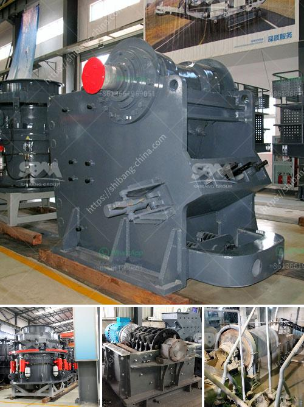

<h3>aggregate quarry crusher operation cost</h3>
Aggregate quarry is one of the most promising business ventures, attracting both investors and environmentalists. The need for high-quality aggregates to fulfil infrastructure projects is ever-increasing. However, quarry crusher operation costs are often a concern for owners, especially if they do not possess sufficient capital or are new to the industry.

The major cost elements that are associated with quarry operations include the cost of explosives, drilling, blasting, transportation, crushing, and screening. These costs can vary greatly depending on the location of the quarry, the size of the operation, the type of aggregate being produced, and various other factors.

To achieve cost-effective quarry crusher operation, a proper maintenance and optimization plan is essential. Regular inspection and maintenance of equipment can prevent unexpected breakdowns and ensure smooth operations. Regular oil changes, filter replacements, and lubrication can significantly extend the life of the equipment and reduce downtime.

Optimizing the crusher operation process is another crucial factor in reducing costs. This involves calibrating the crusher to produce the desired output size with minimum energy consumption. Adjusting the crusher settings, such as the gap between the impact plates and rotor speed, can result in better product quality and lower operational costs.

Transportation costs can be reduced by optimizing haul routes and using fuel-efficient vehicles. Planning the extraction process in a way that minimizes the distance between the extraction point and the crusher can also help reduce transportation costs.

Embracing technological advancements in the industry can further enhance the cost-effectiveness of quarry crusher operations. Implementing automation and remote monitoring systems can improve equipment efficiency and reduce labor costs. Investing in energy-efficient equipment and utilizing renewable energy sources can also help in lowering operational costs in the long run.

Lastly, it is essential to consider environmental regulations and sustainability practices while determining the cost of quarry crusher operations. Implementing eco-friendly initiatives such as water recycling systems, dust suppression mechanisms, and noise reduction measures can attract support from the local community and minimize potential fines or penalties.

In conclusion, while there are various costs associated with quarry crusher operations, proper maintenance, optimization, and embracing technological advancements can help to effectively manage and reduce these costs. Investing in these strategies not only ensures a sustainable and profitable business but also contributes to the overall development of the industry.
<h3>Contact us</h3><ul><li><strong>Whatsapp:&nbsp;<a href="https://wa.me/8613661969651">+8613661969651</a></strong></li><li><a href="https://swt.shibang-china.com/?git&amp;zhl&amp;aggregate quarry crusher operation cost"><strong>Online Service(chat now)</strong></a></li></ul><h3>Related</h3><ul><li><a href='latest aggregate and sand prices in uae.md'>latest aggregate and sand prices in uae</a></li><li><a href='purification process of iron ore.md'>purification process of iron ore</a></li><li><a href='chalk manufacturing machinechalk mining machinery.md'>chalk manufacturing machinechalk mining machinery</a></li><li><a href='products scm ultrafine mill.md'>products scm ultrafine mill</a></li><li><a href='diesel engines grinding mills south africa.md'>diesel engines grinding mills south africa</a></li></ul>