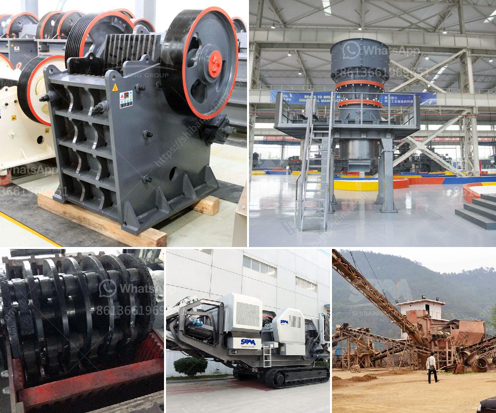

<h3>aggregate washing machine saudi arabia</h3>
Aggregate washing machine Saudi Arabia is definitely the item that is most favored by customers worldwide. Notwithstanding, Saudi Arabia remains relatively unfamiliar in comparison with other countries when it comes to marketing aggregate washing machines. In fact, many people know little about such machinery, let alone purchasing it. This article seeks to shed light on the topic, giving a comprehensive overview of aggregate washing machines in Saudi Arabia.

Aggregate washing machine Saudi Arabia is a kind of cleaning equipment of international advanced level. It is developed on the basis of introducing foreign outstanding technology of the same kind of products. It is mainly used for washing, classifying and dewatering sand in Saudi Arabia, as well as other countries. This machine adopts advanced technology, and combines with the actual situation in domestic and foreign countries to develop efficient and gravel sand washing equipment.

Aggregate washing machine Saudi Arabia has advanced technology and high quality materials, ensuring efficient and reliable operation. In comparison with traditional sand washing machines, this machine has the following advantages:

First, the bearing device of gravel washing machine has reasonable structure, high precision and long service life, ensuring reliable operation and low noise.

Second, the spiral sand washing machine adopts advanced technology, optimizing the structure of the spiral sail. The machine has good sealing performance, avoids the fine material losing effectively, and reduces the dirt and ash content in the sand to improve the sand quality.

Third, this equipment has a high degree of automation, reducing labor intensity and improving productivity. The whole process, including feeding, classifying, washing, dewatering and discharging, can be completed by a single machine.

Fourth, the gravel washing machine has reasonable structure, occupying a small area. It is easy to install and operate, with a high degree of flexibility, adapting to different working environments.

Fifth, the sand washing machine has a wide range of applications. It can be used in construction sites, sand and gravel plants, hydropower stations, concrete dams, glass manufacturing, oil wells, concrete mixing stations, etc. It is the preferred equipment for sand making industry in Saudi Arabia.

In conclusion, aggregate washing machine Saudi Arabia is an essential piece of equipment for sand making production lines. It can effectively improve the quality of sand and gravel, ensuring the market demands in Saudi Arabia are met. The development of aggregate washing machine Saudi Arabia has attracted global attention and appropriately promoted the development of Saudi Arabia's sand and gravel industry.
<h3>Contact us</h3><ul><li><strong>Whatsapp:&nbsp;<a href="https://wa.me/8613661969651">+8613661969651</a></strong></li><li><a href="https://swt.shibang-china.com/?git&amp;zhl&amp;aggregate washing machine saudi arabia"><strong>Online Service(chat now)</strong></a></li></ul><h3>Related</h3><ul><li><a href='stone to sand crusher.md'>stone to sand crusher</a></li><li><a href='used crushing plant johannesburg.md'>used crushing plant johannesburg</a></li><li><a href='crushing machine south africa.md'>crushing machine south africa</a></li><li><a href='jaw crushers china.md'>jaw crushers china</a></li><li><a href='cost of grinding mill.md'>cost of grinding mill</a></li></ul>