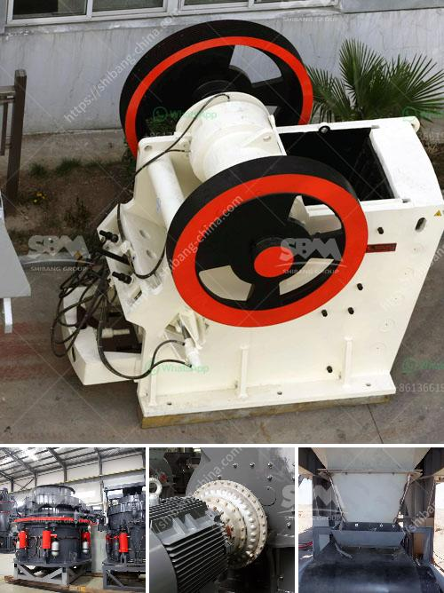

<h3>aggregates crusher cebu</h3>
Aggregates are the backbone of any construction project. Whether it is a residential or commercial development, the need for high-quality aggregates cannot be overstated. In Cebu, one of the leading suppliers of aggregates is a company called Aggregates Crusher Cebu. This trusted company specializes in the production of various aggregates used in construction projects of all sizes.

Aggregates Crusher Cebu has been serving the construction industry in Cebu for many years. What sets them apart from other suppliers is their commitment to delivering top-notch customer service and producing aggregates that meet the highest industry standards. Their dedication to quality has earned them a reputation as one of the most reliable providers of aggregates in the region.

One of the reasons why Aggregates Crusher Cebu is highly regarded is their state-of-the-art crushing plant located in the heart of Cebu. This modern facility boasts advanced equipment and technology, ensuring the production of aggregates that are consistent in size, shape, and quality. The crushing process is carefully monitored to guarantee that the resulting aggregates are free from impurities and meet the specifications required by their customers.

Aggregates Crusher Cebu offers a wide range of aggregates that cater to various construction needs. Their portfolio includes crushed stones, sand, gravel, and other materials used in road construction, building foundations, and landscaping projects. Whether it's for a small backyard renovation or a large-scale infrastructure development, Aggregates Crusher Cebu has the materials to meet any demand.

Aside from their extensive product range, Aggregates Crusher Cebu prides itself on its efficient delivery services. They have a fleet of trucks and heavy equipment to transport aggregates to construction sites promptly. This ensures that their customers do not experience delays in their projects due to the lack of materials.

In addition to supplying aggregates, Aggregates Crusher Cebu also offers relevant technical support and assistance. Their team of experts is available to provide advice on the proper selection and utilization of aggregates for specific construction projects. They understand the importance of using the right materials to achieve optimal results, and they are committed to helping their customers make informed decisions.

Another aspect that sets Aggregates Crusher Cebu apart from its competitors is its commitment to sustainable practices. They are aware of the environmental impact of their operations and take steps to minimize it. This includes proper waste management, recycling efforts, and ensuring compliance with local regulations. As a responsible supplier, Aggregates Crusher Cebu aims to contribute to the growth and development of Cebu while preserving its natural resources.

In conclusion, Aggregates Crusher Cebu is a company that prioritizes quality, customer satisfaction, and environmental responsibility. With their advanced crushing plant, wide range of aggregates, efficient delivery services, and technical support, they have become the go-to supplier for construction projects in Cebu. Whether you're a contractor, developer, or homeowner, you can trust Aggregates Crusher Cebu to provide you with the high-quality aggregates you need for your next project. Their commitment to excellence ensures that your construction endeavors are built on solid ground.
<h3>Contact us</h3><ul><li><strong>Whatsapp:&nbsp;<a href="https://wa.me/8613661969651">+8613661969651</a></strong></li><li><a href="https://swt.shibang-china.com/?git&amp;zhl&amp;aggregates crusher cebu"><strong>Online Service(chat now)</strong></a></li></ul><h3>Related</h3><ul><li><a href='turkish association marble machinery.md'>turkish association marble machinery</a></li><li><a href='cement grinding mill price invest cost.md'>cement grinding mill price invest cost</a></li><li><a href='stone crusher machine price list in kenya.md'>stone crusher machine price list in kenya</a></li><li><a href='pebble stone processing machines.md'>pebble stone processing machines</a></li><li><a href='sand making machine equipment.md'>sand making machine equipment</a></li></ul>