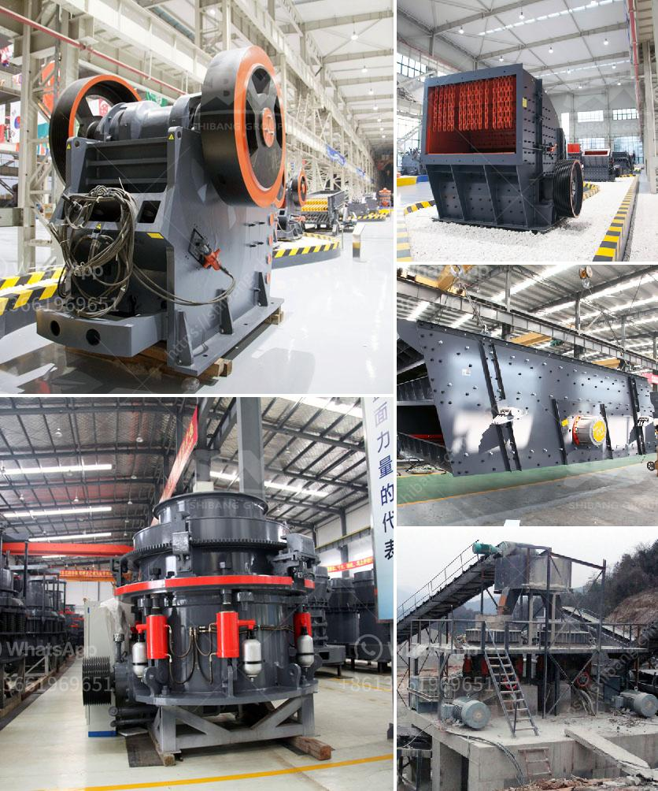

<h3>aggregates crushers for sale</h3>
Aggregates are essential materials in construction projects, and crushers play a key role in the production process. When it comes to finding the right crushers for sale, there are several factors that need to be considered. This article will provide an overview of aggregates crushers for sale and highlight the important features to look for when making a purchasing decision.

Aggregates crushers are machines designed to break larger rocks into smaller pieces or gravel. These machines are widely used in various types of construction projects, such as roads, railways, buildings, bridges, and more. The primary function of aggregates crushers is to reduce the size of the raw materials, making them suitable for further processing.

There are different types of crushers available in the market, each with its own unique features and advantages. Some common types include jaw crushers, impact crushers, cone crushers, and gyratory crushers. Jaw crushers are popular for their simplicity and affordable cost. They are ideal for primary crushing operations and can handle a wide range of materials.

Impact crushers, on the other hand, are widely used for their ability to create cubical-shaped aggregates. They are efficient in crushing softer materials such as limestone and are often used in secondary or tertiary crushing applications. Cone crushers are known for their high efficiency and versatility. They can be used for both primary and secondary crushing and are particularly suitable for processing hard and abrasive materials.

When looking for aggregates crushers for sale, there are several key features to consider. The first is the crusher's capacity or production rate. This refers to the maximum amount of material the crusher can process in a given period. It is crucial to choose a crusher that can meet your production needs.

Another important factor to consider is the crusher's feed opening size. This is the maximum size of the material that the crusher can accept. The feed opening size should be compatible with the size of the materials you intend to crush. Additionally, the crusher's power and speed are important considerations. More powerful and faster crushers can process larger amounts of material in less time.

In addition to these key features, it is essential to look for crushers that are easy to operate and maintain. Accessibility to key components such as the crusher's hopper, jaws, and liners should be considered, as regular maintenance is crucial for efficient operation and longevity.

Furthermore, it is beneficial to purchase crushers from reputable manufacturers or suppliers. This ensures the quality and reliability of the equipment. Reputable manufacturers often provide warranties and after-sales services, which can be valuable in case of any issues or concerns with the crusher.

In conclusion, aggregates crushers are important machines in the construction industry that are used to crush larger rocks into smaller pieces or gravel. When considering crushers for sale, it is crucial to consider factors such as capacity, feed opening size, power, and speed. Additionally, ease of operation, maintenance, and purchasing from reputable manufacturers are important considerations. By taking these factors into account, you can find the right aggregates crusher that meets your production needs and offers reliable performance.
<h3>Contact us</h3><ul><li><strong>Whatsapp:&nbsp;<a href="https://wa.me/8613661969651">+8613661969651</a></strong></li><li><a href="https://swt.shibang-china.com/?git&amp;zhl&amp;aggregates crushers for sale"><strong>Online Service(chat now)</strong></a></li></ul><h3>Related</h3><ul><li><a href='mini mining crusher dealers.md'>mini mining crusher dealers</a></li><li><a href='how to make an industrial stone crusher.md'>how to make an industrial stone crusher</a></li><li><a href='crushing plant in calatagan batangas.md'>crushing plant in calatagan batangas</a></li><li><a href='stone crusher plant manufacturer.md'>stone crusher plant manufacturer</a></li><li><a href='brick crushers for sale in australia.md'>brick crushers for sale in australia</a></li></ul>