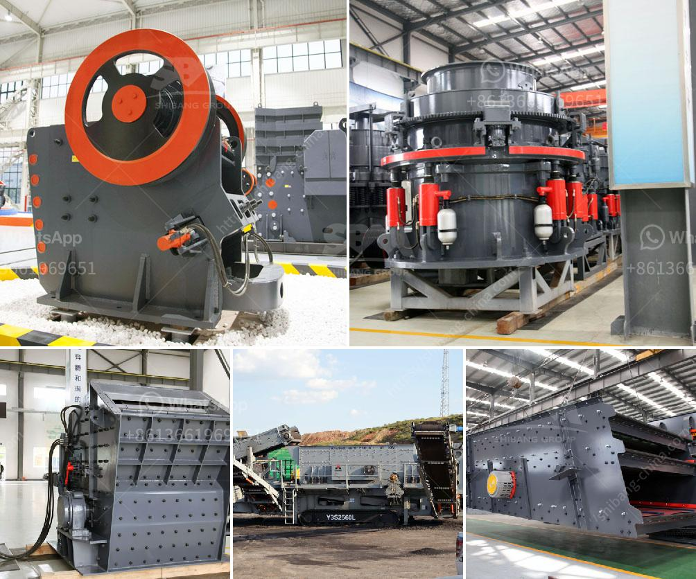

<h3>aggregates crushing plant in angat bulacan</h3>
The stunning province of Bulacan is home to many scenic towns and attractions, but one must-visit destination that you should not miss is the town of Angat. Known for its rich history and breathtaking natural wonders, Angat is also famous for its thriving aggregate crushing plant.

The aggregates crushing plant in Angat Bulacan, often referred to as the "golden triangle" because of its geographical location, is considered to be one of the largest in the Philippines. It has the capacity to produce a variety of aggregates for different construction projects. With a raw material of basalt rocks, the plant produces high-quality aggregates and asphalt used in various construction projects such as roads, bridges, buildings, and dams.

The crushing plant in Angat Bulacan boasts its state-of-the-art machinery, which is capable of turning large rocks into different sizes of aggregates. The plant utilizes advanced technology and modern equipment to consistently produce top-quality aggregates that meet the standards set by the Department of Public Works and Highways (DPWH) and other regulatory bodies.

Apart from its impressive production capacity, what sets this crushing plant apart is its commitment to environmental sustainability. The plant strictly adheres to environmental regulations and implements responsible practices to ensure the preservation of the surrounding ecosystem. Efforts are made to minimize noise pollution, dust emission, and any negative impact on the community and nearby areas.

The aggregates crushing plant in Angat Bulacan plays a vital role in the economic development of the province. It provides employment opportunities for the local community and contributes to the growth of the construction industry. Moreover, the availability of high-quality aggregates within the province reduces the need for importing materials, making construction projects more cost-effective and sustainable.

In conclusion, the aggregates crushing plant in Angat Bulacan is not only a prominent destination for tourists but also a significant contributor to the construction industry. With its state-of-the-art machinery, commitment to environmental sustainability, and exceptional production capacity, this crushing plant plays a vital role in the economic development of the province.
<h3>Contact us</h3><ul><li><strong>Whatsapp:&nbsp;<a href="https://wa.me/8613661969651">+8613661969651</a></strong></li><li><a href="https://swt.shibang-china.com/?git&amp;zhl&amp;aggregates crushing plant in angat bulacan"><strong>Online Service(chat now)</strong></a></li></ul><h3>Related</h3><ul><li><a href='traditional crushing machine.md'>traditional crushing machine</a></li><li><a href='types of diesel hammer mills in zimbabwe.md'>types of diesel hammer mills in zimbabwe</a></li><li><a href='ball mill 10 tph.md'>ball mill 10 tph</a></li><li><a href='pioneer ve rock crusher.md'>pioneer ve rock crusher</a></li><li><a href='jaw crusher in uzbekistan.md'>jaw crusher in uzbekistan</a></li></ul>