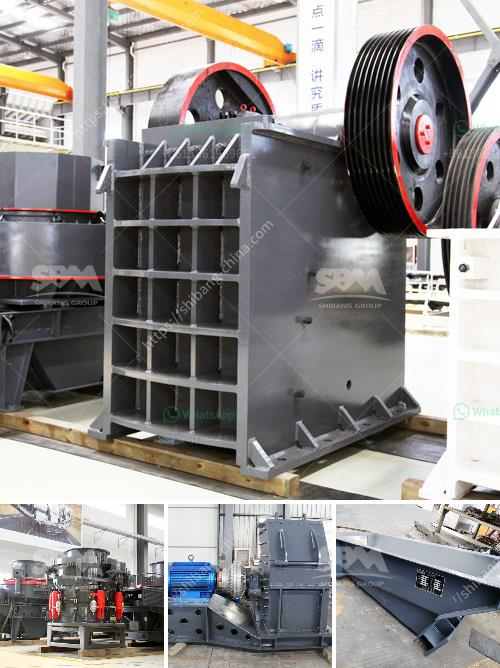

<h3>all model vsi crusher</h3>
The VSI (vertical shaft impact) crusher is a vital tool in the production of sand and gravel aggregates. It is widely used in construction and infrastructure projects to reduce waste and improve efficiency. With the rapid development of the construction industry, the demand for sand and gravel aggregates is constantly increasing, and the VSI crusher has become an indispensable machine in the production line.

There are several models of VSI crushers available in the market today, each designed to meet specific requirements. Let's explore some of the popular models with their unique features and advantages.

1. Barmac B-Series VSI crushers - This model is known for its high production capability and excellent particle shape. With a maximum feed size of up to 60mm, it is suitable for both sand and gravel production. The Barmac B-Series VSI crushers also come with an adjustable cascade system, allowing the operator to control the desired product shape.

2. Sandvik CV200-series VSI crushers - Sandvik's CV200-series VSI crushers are versatile machines that produce high-quality manufactured sand and premium-shaped aggregates. They offer excellent versatility in producing different grades of sand and meet the strictest quality standards.

3. Terex Canica VSI crushers - The Terex Canica VSI crushers are renowned for their high reduction ratios and excellent product shape. They are designed to efficiently process a wide range of materials, including highly abrasive ones. These crushers come with adjustable drop-in anvils and easily replaceable wear parts, ensuring optimal performance and reduced downtime.

4. REMco VSI crushers - REMco VSI crushers are popular for their unique rock-on-rock crushing principle, which minimizes wear and maximizes production. These crushers are known for their low operating costs and high-quality end products. They are also available in various configurations, such as fixed, semi-mobile, and full mobile, to suit different requirements.

5. CEMCO VSI crushers - CEMCO VSI crushers are renowned for their ruggedness and durability. They are designed to handle extremely abrasive materials and ensure high production rates. CEMCO VSI crushers also allow for easy maintenance and quick replacement of wear parts, minimizing downtime.

In conclusion, the VSI crusher is an extremely versatile machine that plays a crucial role in the production of sand and gravel aggregates. Its various models offer unique features and advantages, catering to different application requirements. Whether it is reducing waste, improving product shape, or minimizing operating costs, there is a suitable model for every need. Overall, the VSI crusher has proven to be a reliable and efficient solution for meeting the demand for high-quality aggregates in the construction industry.
<h3>Contact us</h3><ul><li><strong>Whatsapp:&nbsp;<a href="https://wa.me/8613661969651">+8613661969651</a></strong></li><li><a href="https://swt.shibang-china.com/?git&amp;zhl&amp;all model vsi crusher"><strong>Online Service(chat now)</strong></a></li></ul><h3>Related</h3><ul><li><a href='high speed hand powder crushing machine.md'>high speed hand powder crushing machine</a></li><li><a href='super fine grinding machine price in india.md'>super fine grinding machine price in india</a></li><li><a href='cost quarry machines.md'>cost quarry machines</a></li><li><a href='gypsum powder uses in construction.md'>gypsum powder uses in construction</a></li><li><a href='grinding size of bentonite crusher.md'>grinding size of bentonite crusher</a></li></ul>