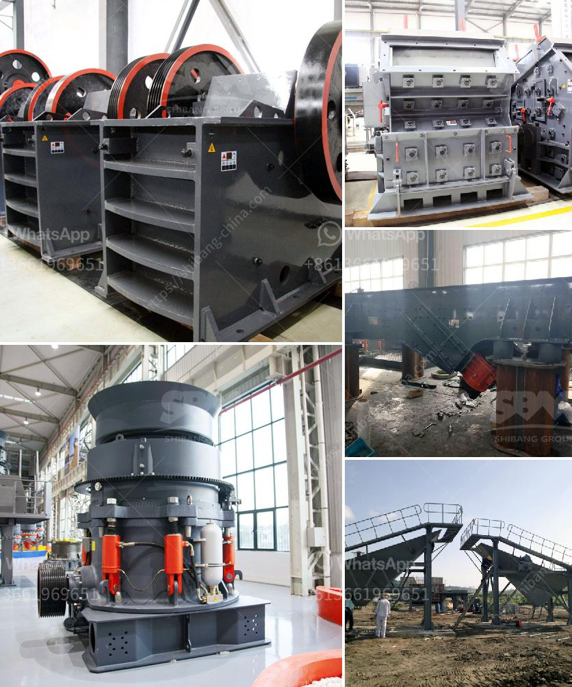

<h3>alluvial chrome wash plant in the usa</h3>
The United States has vast deposits of chrome ore spread across various regions. However, the process of extracting chrome from these deposits can be complex, energy-intensive, and environmentally damaging. In recent years, the introduction of alluvial chrome wash plants in the USA has emerged as a sustainable solution that addresses these concerns.

Alluvial chrome wash plants are specifically designed to extract chrome ore from alluvial deposits, which are loose sediments comprised of gravel, sand, and clay. These deposits are found in riverbeds, floodplains, and deltas, making them easily accessible for mining operations. Unlike traditional mining methods that involve aggressive excavation and infrastructure development, alluvial chrome wash plants utilize a more environmentally friendly approach.

One of the key advantages of alluvial chrome wash plants is their low energy consumption. These plants operate through a combination of gravity separation and water-based concentration techniques. Chrome ore particles are first separated from undesirable materials using gravity-based separators. Heavy particles, such as chrome ore, settle at the bottom while lighter impurities are carried away by water currents. This initial separation process significantly reduces the energy required for subsequent concentration and refining processes.

Water is a crucial element in alluvial chrome wash plants as it is used for both washing and concentration purposes. The entire process is designed to minimize water consumption and maximize recycling. Water is continuously circulated within the plant, reducing the need for excessive freshwater intake. Additionally, specialized settling ponds and filtration systems ensure that wastewater is treated before being released back into the environment, minimizing any potential environmental impacts.

The deployment of alluvial chrome wash plants in the USA also offers economic benefits. These plants provide employment opportunities for local communities and support economic growth in the region. Moreover, the low energy consumption and reduced infrastructure requirements lower operating costs, making chrome extraction more economically viable.

The implementation of alluvial chrome wash plants in the USA aligns with the global trend towards sustainable mining practices. Various governmental regulations and international agreements now prioritize the adoption of environmentally responsible approaches in the mining sector. Alluvial chrome wash plants offer a path to comply with these requirements by minimizing environmental impacts, conserving natural resources, and reducing carbon emissions.

Furthermore, the end product derived from alluvial chrome wash plants, namely chrome concentrate, has significant market demand. Chrome concentrate is widely used in various industries, including metallurgy, automobile manufacturing, and construction. The availability of sustainably sourced chrome from alluvial deposits in the USA strengthens the nation's position in these global markets, providing a competitive advantage and contributing to economic growth.

In conclusion, the introduction of alluvial chrome wash plants in the USA represents a significant step towards sustainable chrome ore extraction. These plants offer low-energy and environmentally friendly alternatives for extracting chrome from alluvial deposits. By minimizing water consumption, optimizing recycling, and adhering to stringent environment regulations, alluvial chrome wash plants provide an economically viable and sustainable solution that meets market demands while preserving the environment for future generations.
<h3>Contact us</h3><ul><li><strong>Whatsapp:&nbsp;<a href="https://wa.me/8613661969651">+8613661969651</a></strong></li><li><a href="https://swt.shibang-china.com/?git&amp;zhl&amp;alluvial chrome wash plant in the usa"><strong>Online Service(chat now)</strong></a></li></ul><h3>Related</h3><ul><li><a href='crusher manufacturer in saudi.md'>crusher manufacturer in saudi</a></li><li><a href='closed quarrz plants in kenya.md'>closed quarrz plants in kenya</a></li><li><a href='wet ball mills manufacturers.md'>wet ball mills manufacturers</a></li><li><a href='bentonite plant system.md'>bentonite plant system</a></li><li><a href='gold mining equipment from japan.md'>gold mining equipment from japan</a></li></ul>