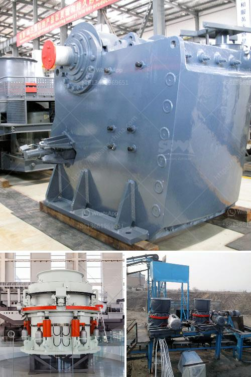

<h3>alluvial gold washing machine manufacturer</h3>
Alluvial gold is a kind of gold ore produced in the bottom or low-lying areas of rivers, mixed with stone sand that can be washed out. Artificial gold panning is a common gold mining method for alluvial gold, but with the development of mineral processing technology, the alluvial gold mining method has become diversified, the type of alluvial gold mining equipment has also increased.

The alluvial gold washing machine manufacturers are boasting their high-quality products with all latest technologies. However, they are hardly meeting the market’s ever-growing demands. Instead, they are lagging behind their international competitors, who are producing better quality machines at a more affordable price. This current scenario requires immediate attention from the manufacturers to catch up with their competitors.

One of the major problems observed is the lack of research and development in this field. Without investing in new technologies and machinery, the manufacturers are repeating the same old mistakes. While the international manufacturers are embracing advanced technologies like automation, robotics, and artificial intelligence, the local manufacturers are still stuck with outdated machinery.

Another issue faced by the alluvial gold washing machine manufacturers is the lack of skilled labor. The intricate process of manufacturing gold washing machines requires skilled workers who are experienced in metallurgy, electrical engineering, and other related fields. Unfortunately, the shortage of such workers is hampering the growth of this industry, resulting in substandard machines being produced.

Furthermore, the manufacturers need to focus on product innovation and customization. Each mine has its unique requirements and challenges, and the one-size-fits-all approach is not suitable. The manufacturers should develop machines that are adaptable and flexible to cater to different mining conditions. This will not only improve the efficiency of gold washing but also reduce the environmental impact of mining operations.

Moreover, the alluvial gold washing machine manufacturers must consider the sustainability aspect of their machines. Mining, in general, has a significant impact on the environment, and it is crucial for manufacturers to develop machines that are environmentally friendly. This can be achieved by using energy-efficient components, reducing water consumption, and implementing effective waste management systems.

In conclusion, the alluvial gold washing machine manufacturers need to step up their game to stay competitive in the market. They should invest in research and development, focus on product innovation, employ skilled labor, and prioritize sustainability. This will not only help them meet the market's demands but also contribute to the overall growth and development of the mining industry. Failure to address these issues may lead to a decline in the market share for local manufacturers, while international competitors continue to dominate the global market.
<h3>Contact us</h3><ul><li><strong>Whatsapp:&nbsp;<a href="https://wa.me/8613661969651">+8613661969651</a></strong></li><li><a href="https://swt.shibang-china.com/?git&amp;zhl&amp;alluvial gold washing machine manufacturer"><strong>Online Service(chat now)</strong></a></li></ul><h3>Related</h3><ul><li><a href='stone crushing quarry works with conveyor belt.md'>stone crushing quarry works with conveyor belt</a></li><li><a href='jaw crusher manufacturers.md'>jaw crusher manufacturers</a></li><li><a href='process chart of sand washing plant.md'>process chart of sand washing plant</a></li><li><a href='canada gold mining equipment.md'>canada gold mining equipment</a></li><li><a href='high speed hand powder crushing machine.md'>high speed hand powder crushing machine</a></li></ul>