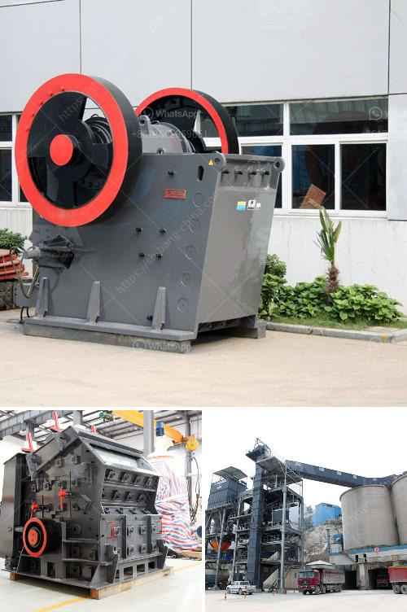

<h3>apron in cement plant crusher</h3>
The apron in a cement plant crusher is meant to protect the crusher machine and absorb the impact of raw material dumped onto it. This serves to extend the service life of the crushing machine, as the apron is made of high-quality materials and is therefore resistant to wear.

At a cement plant, the crusher machine is constantly in contact with various materials used in the construction industry. This includes limestone, gypsum, clay, and other types of aggregate. These materials are dumped onto the crusher through a hopper or a conveyor belt. Without a protective apron, the impact of these materials hitting the crusher would cause significant damage and reduce its efficiency.

The apron in a cement plant crusher serves as a shield that protects the crushing machine from potential damage. It absorbs the impact of the materials being dumped onto it, reducing the risk of wear and tear. This is important because a damaged crusher machine can lead to downtime, costly repairs, and reduced productivity in the cement plant.

Moreover, the apron in a cement plant crusher is designed to be easily replaceable. This allows for quick and efficient maintenance, minimizing the downtime of the crushing machine. The replacement process involves removing the worn-out apron and installing a new one, ensuring the crusher is back up and running in no time.

The use of an apron in a cement plant crusher is essential for maintaining the efficiency and productivity of the plant. It not only protects the crushing machine from damage but also extends its service life. By investing in a high-quality apron, cement plants can reduce downtime, increase productivity, and ultimately achieve better results in the construction industry.
<h3>Contact us</h3><ul><li><strong>Whatsapp:&nbsp;<a href="https://wa.me/8613661969651">+8613661969651</a></strong></li><li><a href="https://swt.shibang-china.com/?git&amp;zhl&amp;apron in cement plant crusher"><strong>Online Service(chat now)</strong></a></li></ul><h3>Related</h3><ul><li><a href='quartz stone powder.md'>quartz stone powder</a></li><li><a href='quarrying crusher machines.md'>quarrying crusher machines</a></li><li><a href='crush machine price in pakistan.md'>crush machine price in pakistan</a></li><li><a href='stone crusher plant for sale philippines.md'>stone crusher plant for sale philippines</a></li><li><a href='price of raymond mill.md'>price of raymond mill</a></li></ul>