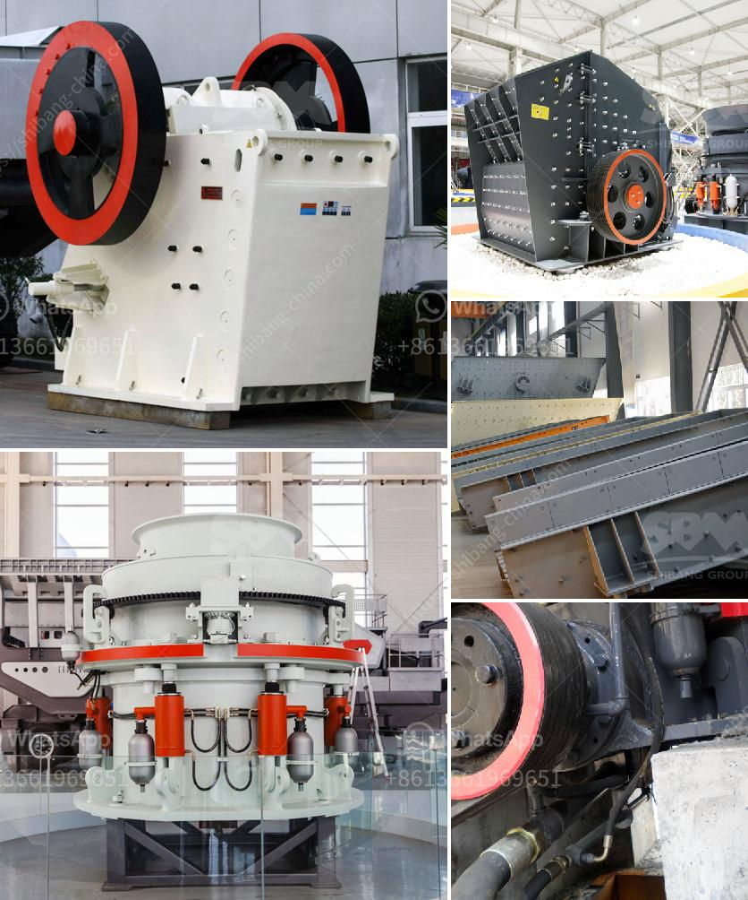

<h3>argentine hammer mills</h3>
The Argentine hammer mill is one of the most popular tools used in the agricultural sector for grinding grains and other products. This machine consists of a series of hammers that rotate at high speed inside a cylindrical casing. The grinding process is achieved by the impact of the hammers against the material, reducing it to smaller particles.

The use of hammer mills in Argentina dates back to the early 20th century when farmers started to use them for grinding grain. Since then, they have become an essential tool in agriculture, as they provide a fast and efficient way to process different types of crops.

One of the main advantages of Argentine hammer mills is their versatility. These machines can grind a wide variety of materials, including grains, oilseeds, biomass, and even certain industrial products. This makes them suitable for many applications, such as animal feed production, flour milling, and biomass processing.

Another important feature of Argentine hammer mills is their robust construction. These machines are built to withstand heavy-duty use and can operate continuously for long hours without a problem. The hammers and other critical components are made of high-quality materials that guarantee their durability and performance over time.

In addition to their durability, Argentine hammer mills are known for their high grinding capacity. These machines can process large quantities of material in a short amount of time, which is crucial for efficient production in the agricultural sector. The grinding process is also highly customizable, as the machine's settings can be adjusted to achieve the desired particle size.

The efficiency of Argentine hammer mills is further enhanced by their low energy consumption. These machines are designed to minimize power requirements without compromising their grinding capacity. This not only reduces operational costs but also contributes to a more sustainable and environmentally friendly agriculture.

The maintenance of Argentine hammer mills is relatively simple and straightforward. Regular inspections and routine cleaning are usually enough to keep these machines in optimal working condition. Additionally, most manufacturers provide technical assistance and spare parts to facilitate any necessary repairs or replacements.

Argentine hammer mills have gained recognition not only in Argentina but also worldwide. Their reputation as reliable and efficient grinding machines has made them a preferred choice for many farmers and agricultural processors. Their versatility, robustness, high grinding capacity, low energy consumption, and easy maintenance make them a valuable asset in modern agriculture.

In conclusion, Argentine hammer mills play a crucial role in the agricultural sector by providing fast and efficient grinding solutions. Their versatility, durability, high grinding capacity, low energy consumption, and easy maintenance make them an indispensable tool for farmers and agricultural processors. These machines have undoubtedly contributed to improving productivity and sustainability in modern agriculture.
<h3>Contact us</h3><ul><li><strong>Whatsapp:&nbsp;<a href="https://wa.me/8613661969651">+8613661969651</a></strong></li><li><a href="https://swt.shibang-china.com/?git&amp;zhl&amp;argentine hammer mills"><strong>Online Service(chat now)</strong></a></li></ul><h3>Related</h3><ul><li><a href='new technology stone crusher in india.md'>new technology stone crusher in india</a></li><li><a href='cost of small mica processing plant in giridih india.md'>cost of small mica processing plant in giridih india</a></li><li><a href='portable concrete crusher for rent qatar.md'>portable concrete crusher for rent qatar</a></li><li><a href='jaw crusher pe.md'>jaw crusher pe</a></li><li><a href='crusher price zenith.md'>crusher price zenith</a></li></ul>