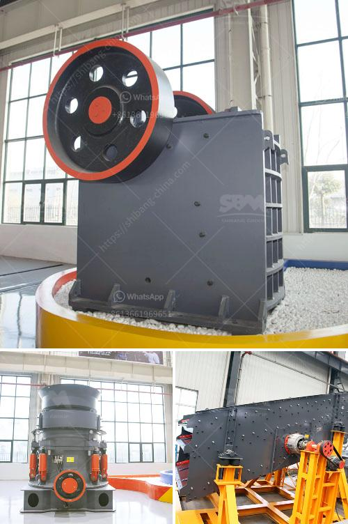

<h3>arriendo de chancadores chile</h3>
Arriendo de chancadores Chile, or the rental of crushers in Chile, is a service provided by various companies in the country. Chancadores, also known as crushers, are heavy-duty machines used in the mining industry to break down large rocks into smaller, more manageable pieces.

Chile is a leading player in the global mining sector, and the demand for crushers is high. However, not all companies can afford to purchase these expensive machines. This is where arriendo de chancadores Chile comes in. By renting crushers instead of buying them, companies can enjoy the benefits of these machines without the hefty upfront cost.

There are several advantages to renting chancadores in Chile. First and foremost, it allows companies to access state-of-the-art equipment without the need for a large capital investment. This is particularly beneficial for smaller mining operations or those with limited financial resources.

Additionally, renting crushers provides flexibility. Companies can choose the specific type and size of the chancador that suits their needs, and they can easily switch to a different model if required. This adaptability ensures that companies always have access to the most suitable equipment for the job.

Moreover, when renting chancadores, there is no need to worry about maintenance and repairs. The rental company takes care of these aspects, reducing the downtime and costs associated with machine breakdowns. This allows mining companies to focus on their core operations and maximize productivity.

The arriendo de chancadores Chile industry is highly competitive, with several companies offering such services. This competition benefits customers as it leads to competitive pricing and a range of options to choose from. Companies can compare different rental rates, terms, and conditions before selecting the most suitable provider.

In conclusion, arriendo de chancadores Chile is a valuable service for mining companies in the country. By renting crushers, companies can access top-quality equipment, enjoy flexibility, and reduce maintenance costs. As the mining industry continues to thrive in Chile, the demand for chancadores rentals is expected to increase.
<h3>Contact us</h3><ul><li><strong>Whatsapp:&nbsp;<a href="https://wa.me/8613661969651">+8613661969651</a></strong></li><li><a href="https://swt.shibang-china.com/?git&amp;zhl&amp;arriendo de chancadores chile"><strong>Online Service(chat now)</strong></a></li></ul><h3>Related</h3><ul><li><a href='crusher plant supplier.md'>crusher plant supplier</a></li><li><a href='stone quarry crusher machines.md'>stone quarry crusher machines</a></li><li><a href='fine powder mill.md'>fine powder mill</a></li><li><a href='quarry machine in kenya.md'>quarry machine in kenya</a></li><li><a href='silica sand crusher price in india.md'>silica sand crusher price in india</a></li></ul>