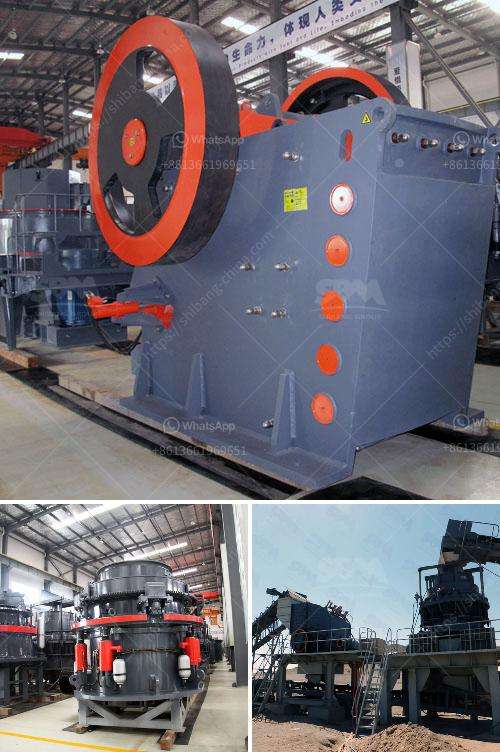

<h3>artificial sand making</h3>
Artificial sand, also called crushed sand or mechanical sand, refers to rocks, mine tailings or industrial waste granules with a particle size of less than 4.75 mm. It is processed by mechanical crushing and sieving. In China, the artificial sand was mainly used in the construction of hydropower systems. For example, the Three Gorges Project and the Yellow River Diversion Project used artificial sand to prepare concrete. Due to the ban on natural sand mining, the demand for sand and gravel has increased, leading to the development of artificial sand making.

This method of sand production came into being in the early 20th century. In the 1970s, the United States and Germany first developed this method. Natural sand was mainly used in hydropower projects and other fields before the 1980s. With the depletion of resources, natural sand became harder to obtain, which led to the birth of artificial sand.

Feeding: The stones are blasted down from the mountain and large stones are fed into the vibrating feeder by dump trucks.

Coarse and fine crushing: The vibrating feeder feeds the stone evenly into the coarse crushing machines for the primary crushing of the stone. The crushed stone from the coarse crushing equipment is transported through the belt conveyor to the fine crushing machines for the secondary crushing. Primary crushing equipment: The primary crushing equipment directly processes supplied materials from the stone material factory and is the foremost processing plant. The jaw crusher is the ideal choice for primary crushing.

Secondary crushing equipment: After primary crushing, the crushed material is conveyed to the secondary crushing equipment. Impact crusher or cone crusher is used for secondarily crushing the crushed materials. Sand and gravel materials are produced in the same way as crushed stone. Crushed stone usually has more angled surfaces than gravel as a result of the crushing process.

Crushed stone can also range in size from fine dust to large rocks. Gravel is more rounded and often smaller than crushed stone. Gravel also comes in various sizes, from 6mm up to 50mm. Uses for crushed stone and gravel

Both aggregates are most commonly used for construction projects. The angular surfaces of crushed stone make it perfect for forming flat surfaces when compacted or rolled. It makes a stable, interlocking base for concrete foundations, roads and floors.

Crushed stone is also ideal for railway track ballast beds, a filler element, drainage system and retaining walls on shorelines and mountain roads.

Gravel, being smoother, is often used for aesthetic purposes. It can be purely decorative and create a feature in your garden such as a rockery, pond, or waterfall.

In conclusion, artificial sand making has gained rapid development since the 20th century in Canada, China, and western Europe. Large-scale construction projects, especially in infrastructure construction, are expected to drive the growth of the artificial sand market. In the near future, China's demand for artificial sand will continue to rise, and the Indian government has issued a series of policies to support the development of artificial sand. For example, India is currently constructing a highway project and has a requirement of 40 million cubic meters of sand and aggregate. Hawaii's famous man-made resort beaches, including Hilton Beach and Marriott Resort Beach, were all constructed with artificial sand. To meet the ever-increasing demand, artificial sand is being used in tandem with natural sand.
<h3>Contact us</h3><ul><li><strong>Whatsapp:&nbsp;<a href="https://wa.me/8613661969651">+8613661969651</a></strong></li><li><a href="https://swt.shibang-china.com/?git&amp;zhl&amp;artificial sand making"><strong>Online Service(chat now)</strong></a></li></ul><h3>Related</h3><ul><li><a href='sand wash plants for sale in texas.md'>sand wash plants for sale in texas</a></li><li><a href='used mobile crusher pakistan.md'>used mobile crusher pakistan</a></li><li><a href='crushers made in south philippines.md'>crushers made in south philippines</a></li><li><a href='silico manganese manufacturing equipment.md'>silico manganese manufacturing equipment</a></li><li><a href='basalt fiber production lines.md'>basalt fiber production lines</a></li></ul>