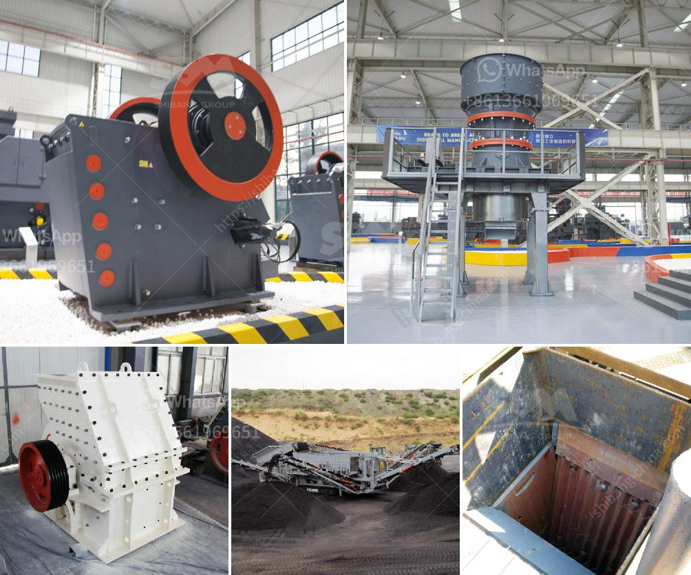

<h3>ball mill 10 tph</h3>
The ball mill is an essential grinding equipment for concentrators. It is mainly used for grinding operations before sorting. It is equipped with grading equipment for grinding and grading to complete the sorting of minerals. It is widely used in cement, silicate products, and new building materials. , Refractory materials, chemical fertilizers, ferrous and non-ferrous metal beneficiation and glass ceramics and other production industries, dry or wet grinding various ores and other grindable materials.

The ball mill can process materials with a feed size of 10mm into a product size of 200 mesh or finer in a closed circuit. The choice of ball mill types depends on various factors, such as the feed size, the product size, the required fineness, the mill size, and the capacity. These factors along with the bonding characteristics of the ore determine the selection of ball mill types and sizes.

1. Good grinding effect and high production efficiency. The steel ball is placed in the ball mill. Because the internal diameter of the cylinder is large, the steel ball near the cylinder wall causes comminution by impact, and the steel ball near the center of the cylinder causes grinding by abrasion.

2. Uniform product size and low over-crushing rate. The main reason for the high comminution efficiency of ball mills is the increased contact area of ​​balls.

3. Convenient installation, operation, and maintenance. The grid plate is equipped with a lifting device and a compressed air self-locking device to easily adjust the fineness of the product, and at the same time, the structure of the grid plate is simple and reliable, and the maintenance is convenient.

The 10 tph ball mill is a relatively small ball mill, which has a simple structure and convenient operation. However, its investment in the equipment is relatively high, and the equipment of the ball mill is relatively expensive, so it is easy to be more expensive in price.

In conclusion, the ball mill is an efficient grinding tool which can process materials with a feed size of 10mm into a product size of 200 mesh or finer, and it is widely used in the production of various ores and other grindable materials. The 10 tph ball mill is a relatively small ball mill.
<h3>Contact us</h3><ul><li><strong>Whatsapp:&nbsp;<a href="https://wa.me/8613661969651">+8613661969651</a></strong></li><li><a href="https://swt.shibang-china.com/?git&amp;zhl&amp;ball mill 10 tph"><strong>Online Service(chat now)</strong></a></li></ul><h3>Related</h3><ul><li><a href='jaw crusher supplier in philippines.md'>jaw crusher supplier in philippines</a></li><li><a href='gravel wash plant homemade.md'>gravel wash plant homemade</a></li><li><a href='quarry stone crusher for sale in south africa.md'>quarry stone crusher for sale in south africa</a></li><li><a href='new technology ball mill factories europe.md'>new technology ball mill factories europe</a></li><li><a href='mica crusher production plants.md'>mica crusher production plants</a></li></ul>