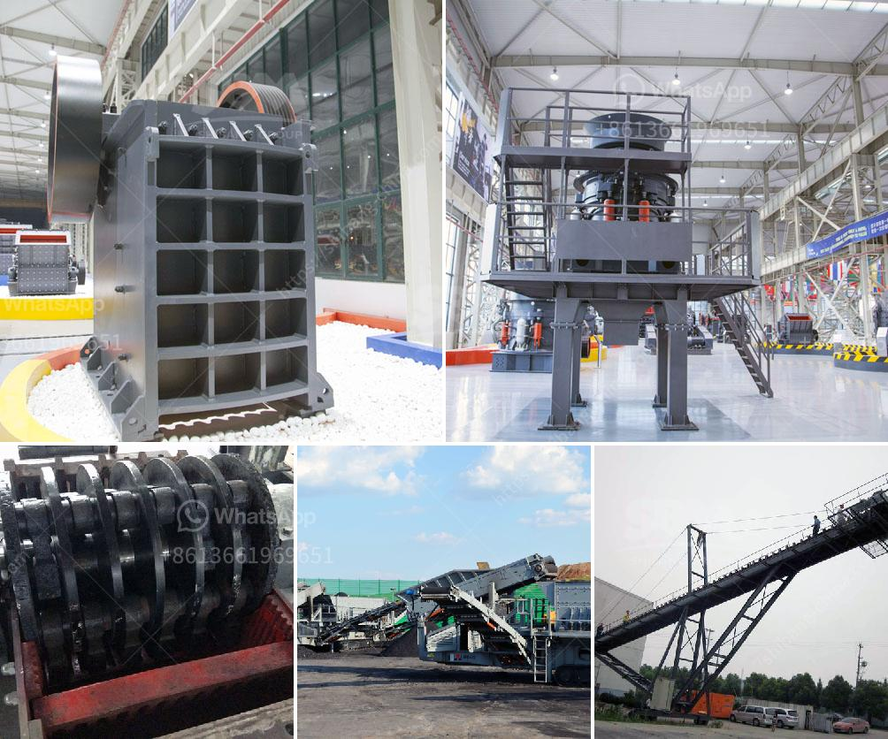

<h3>ball mill ball mill factories</h3>
The ball mill is a key piece of equipment for grinding crushed materials. It is widely used in production lines for powders such as cement, silicates, refractory material, fertilizer, glass ceramics, etc. as well as for ore dressing of both ferrous and non-ferrous metals. The ball mill can grind various ores and other materials either wet or dry.

Ball mills are designed to grind different kinds of material, including clinker, gypsum, nickel ore, gold ore, iron ore, and other mineral dressing or beneficiation purposes. They can be classified either as grate-discharge or overflow-discharge type, depending on the grinding process. Unlike the over-overflow type, the grate discharge type allows the grinding process to be more efficient as it directly interacts with the material.

Ball mill factories play crucial roles in the mining and production industries since they are responsible for grinding materials into small particles. To make the grinding process smooth and efficient, ball mill factories need to develop reliable and quality machinery to ensure maximum productivity and profitability.

First and foremost, ball mill factories need to invest in state-of-the-art technology to enhance efficiency. This can be achieved by introducing automation features, such as computerized control systems and sensors that monitor the grinding process. These technologies enable operators to have real-time data on the mill's performance and make adjustments accordingly. Additionally, auto-control systems decrease the chances of human error, resulting in more accurate and consistent grinding outcomes.

Moreover, ball mill factories should focus on producing high-quality machinery with durable components. It is crucial to avoid cutting corners on the manufacturing process to save costs, as this can lead to frequent breakdowns and repairs. By using top-quality materials and precise machining techniques, factories can ensure that their ball mills have a longer lifespan and require minimal maintenance. This leads to increased productivity and fewer interruptions in the production process.

Another key aspect that ball mill factories should consider is energy efficiency. Energy consumption is a significant cost factor in running a ball mill. Therefore, factories need to invest in energy-saving technologies, such as using variable frequency drives (VFDs) to control motor speed. VFDs allow mills to run at optimal speeds, reducing energy consumption and costs. Additionally, factories can explore environmentally friendly energy sources, such as renewable energy, to power their operations while reducing their carbon footprint.

Furthermore, maintaining a strong focus on research and development is vital for ball mill factories. By staying up-to-date with the latest advancements in grinding technology, factories can continually improve their machinery and processes. This includes incorporating new materials and designs that enhance grinding efficiency and reduce wear and tear. Periodic engineering analysis and testing can provide valuable insights into areas for improvement and optimization.

In conclusion, ball mill factories are essential in the mining and production industries. To ensure maximum efficiency and profitability, these factories need to invest in cutting-edge technology, produce high-quality machinery, prioritize energy efficiency, and conduct continuous research and development. By doing so, they can deliver reliable ball mills that meet the evolving needs of their customers and contribute to sustainable development.
<h3>Contact us</h3><ul><li><strong>Whatsapp:&nbsp;<a href="https://wa.me/8613661969651">+8613661969651</a></strong></li><li><a href="https://swt.shibang-china.com/?git&amp;zhl&amp;ball mill ball mill factories"><strong>Online Service(chat now)</strong></a></li></ul><h3>Related</h3><ul><li><a href='mobile stone crushers south africa.md'>mobile stone crushers south africa</a></li><li><a href='mineral material crusher.md'>mineral material crusher</a></li><li><a href='limestone grinding machine.md'>limestone grinding machine</a></li><li><a href='rotary kiln manufacturers.md'>rotary kiln manufacturers</a></li><li><a href='crusher equipment oman in muscat oman.md'>crusher equipment oman in muscat oman</a></li></ul>