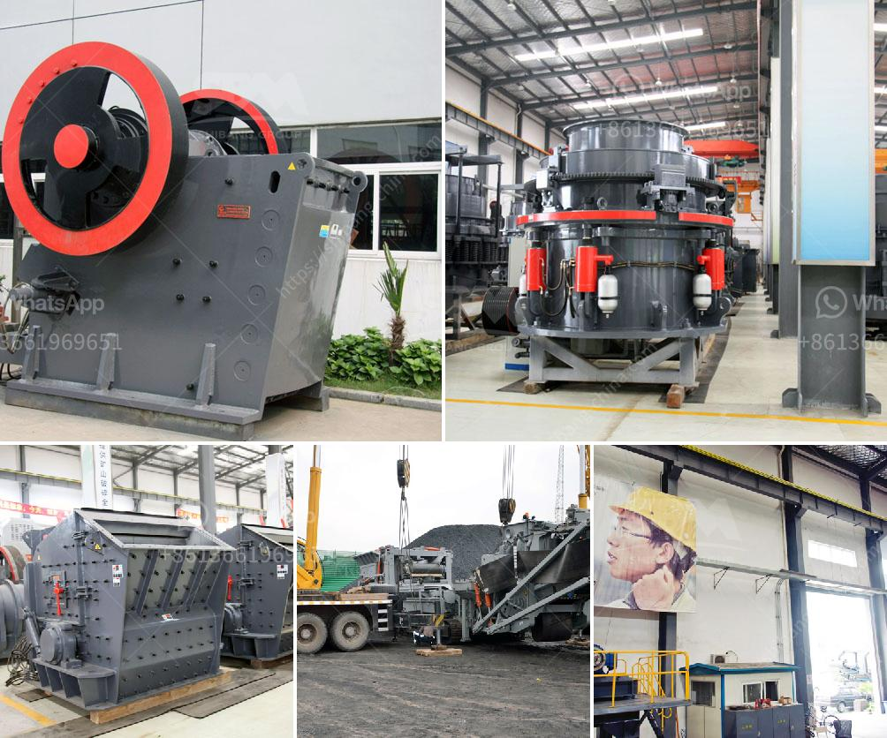

<h3>ball mill constraction</h3>
A ball mill is a type of grinding mill that is used to finely grind materials. It is mainly used for grinding minerals, cement, and other industrial materials. Since its invention, the ball mill has been an essential piece of equipment for mineral processing plants, paint factories, and ceramic factories.

The construction of a ball mill involves a hollow cylindrical shell rotating about its axis. The axis of the shell may be either horizontal or at a small angle to the horizontal. It is partially filled with balls that are made of steel, stainless steel, ceramic, or rubber. The inner surface of the shell is lined with an abrasion-resistant material such as manganese steel or rubber to protect the shell from the impact of the grinding media.

The ball mill consists of a rotating drum that contains a mixture of the grinding media (balls) and the material to be ground. As the drum rotates, the grinding media tumble and crush the material to produce a fine powder. The motion of the balls depends on the speed of rotation of the mill and the desired fineness of the product. Typically, the drum rotates at a speed of 70-80% of the critical speed, which is the speed at which centrifugal force is equal to the gravitational force on the grinding media.

The main components of a ball mill include the shell, the grinding media, the mill liners, and the motor. The shell is the outermost part of the mill, and it protects the mill from external factors such as dust and moisture. The shell also contains the grinding media and the material to be ground. The grinding media are the balls or pebbles that are used for grinding the material. They are usually made of steel, ceramic, or rubber and come in various sizes to produce different fineness levels.

The mill liners are the protective lining inside the mill that prevents wear and tear of the shell. They are typically made of rubber, steel, or ceramic and are attached to the inside wall of the mill. The size and shape of the mill liners depend on the specific requirements of the mill and the material being processed.

The motor of the ball mill is responsible for rotating the drum and driving the grinding media. It can be either a synchronous motor or an asynchronous motor, depending on the speed required. The motor is usually coupled to a gearbox, which controls the speed of rotation of the drum.

In conclusion, the construction of a ball mill involves a hollow cylindrical shell, grinding media, mill liners, and a motor. It is primarily used for grinding minerals, cement, and other industrial materials. The ball mill is an essential piece of equipment for mineral processing plants, paint factories, and ceramic factories, ensuring the efficient grinding of materials for various applications.
<h3>Contact us</h3><ul><li><strong>Whatsapp:&nbsp;<a href="https://wa.me/8613661969651">+8613661969651</a></strong></li><li><a href="https://swt.shibang-china.com/?git&amp;zhl&amp;ball mill constraction"><strong>Online Service(chat now)</strong></a></li></ul><h3>Related</h3><ul><li><a href='dorries vertical grinders used for sale europe.md'>dorries vertical grinders used for sale europe</a></li><li><a href='cement grinding mill price invest cost.md'>cement grinding mill price invest cost</a></li><li><a href='ball mill for sale.md'>ball mill for sale</a></li><li><a href='grinding media loading in ball mill machine.md'>grinding media loading in ball mill machine</a></li><li><a href='price list jaw crusher 150 x 200mm.md'>price list jaw crusher 150 x 200mm</a></li></ul>