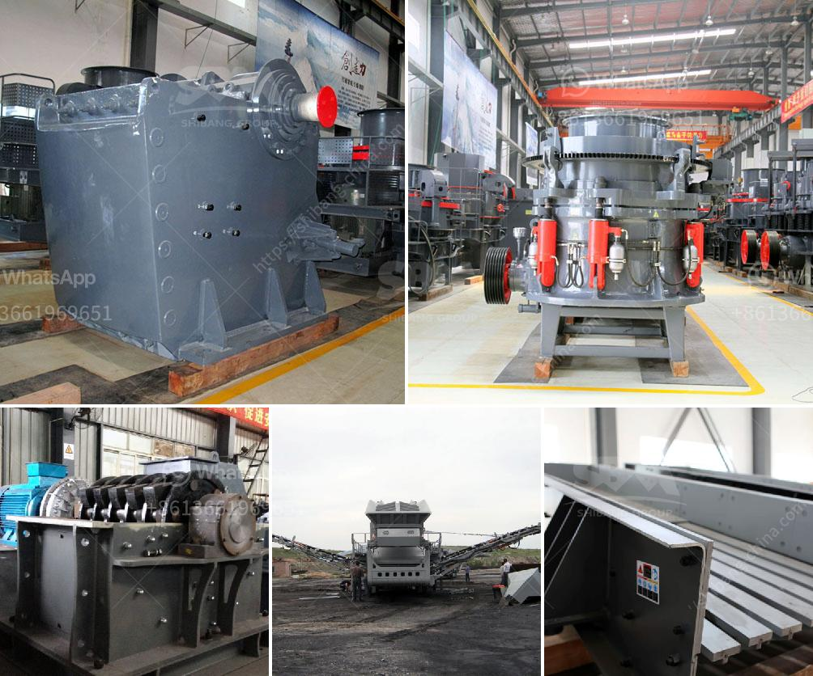

<h3>ball mill cost estimate for mining plant</h3>
Ball mill is widely used in mining, smelting, road, building material and chemical. It is the key equipment for grinding after the crush process.The mill consists of feeding device, driving assembly, rotating assembly, bearing unit, discharging assembly and foundation unit.There are two discharging type: wet grid ball mill and dry grid ball mill.

Ball mill is mainly composed of feeding part, discharging part, rotary part and driving part which includes reducer, small drive gear, electrical machine and electronic control.The hollow shaft is made of cast steel with changeable inner lining plate. The big rotary gear is processed by hobbing castings, and the barrel is provided with wear-resistant lining, which has good wear-resistance. The machine is with stable and reliable working condition. Moreover, according to different materials and discharging methods, there are dry ball mills and wet ball mills for choice.

As per material discharging mode: wet grinding mill, dry grinding mill & overflow mill. As per driving mode: side & central driving.

Bulk materials are crushed by jaw crusher to the desired size, by the elevator sent to the storage hopper, and then the vibrating feeder evenly send the material into the host and continuously grinding in mill room, after grinding, the powder will flow up by the wind machine, and classified by the classifier, the standard powder will flow through the pipe into the powder collector, the collection is separated by a valve discharge, and this is the final product.

There are many factors affecting the production capacity of the ball mill, in addition to the nature of the material (grain size, hardness, density, temperature and humidity), the degree of grinding (product size), the uniformity of the feeding material, and the portion of loaded, , and the milling system (including the level of ball filling, grinding concentration, and the ratio of the mill speed, grinding medium, etc.) in addition to the size and the grindability of the feed material itself, the size and equipment components of the ball mill itself will also affect the economic benefits of the dressing plant. Therefore, before the equipment selection, the measures of the following aspects should be considered:

1. Determine the required specifications of the ball mill. The diameter, length and annual output of the ball mill determine the power of the motor and the power consumption of the grinding medium.

2. Determine the construction of the ball mill. The motor power should be determined according to the required ball milling capacity, the construction of the ball mill (whether it needs to build grate, the overflow type ball mill should be installed with the nitrate drainage device to ensure the normal discharging capacity of the mill), the shape of the ball mill (cylindrical, cone, truncated cone), the ratio of the length to the diameter, the material of the liner, the particle size of the grinding medium and the load degree of the empty material.

3. Calculate the ball charge volume. The volume of the ball charge is a difficult problem because it is usually determined by the rough characters of the grinding material and the sum of the grinding medium. Therefore, under the provision of filling ratio, the volume of the ball charge should be calculated according to the grinding power consumption and the productivity of the grinding medium.

4. Determine the ball filling rate. The filling rate of grinding medium can be calculated from the filling ratio of grinding medium (loading media filling ratio), and filling rate of empty space (when the ball mill grinds the wet material, due to its limited air flow through the ball mill, additional drying equipment is usually required in front of the ball mill).

In conclusion, ball mill is a necessary equipment for mining plant and the entire ball mill cost is figured out and the practical economics should be clearly understood. However, what must be noticed is that the influence of each of these factors on the end product is the highest, while the remaining impact factors have no linear relation, and their influence on the finished product is relatively small. Therefore, it is necessary to consider the comprehensive effect of multiple factors in the actual operation.
<h3>Contact us</h3><ul><li><strong>Whatsapp:&nbsp;<a href="https://wa.me/8613661969651">+8613661969651</a></strong></li><li><a href="https://swt.shibang-china.com/?git&amp;zhl&amp;ball mill cost estimate for mining plant"><strong>Online Service(chat now)</strong></a></li></ul><h3>Related</h3><ul><li><a href='mini robo sand unit price in india.md'>mini robo sand unit price in india</a></li><li><a href='bauxite crushing processing equipments.md'>bauxite crushing processing equipments</a></li><li><a href='coal pulverizer machine hammer.md'>coal pulverizer machine hammer</a></li><li><a href='stone crusher maker in india.md'>stone crusher maker in india</a></li><li><a href='salcu powder washing machine.md'>salcu powder washing machine</a></li></ul>