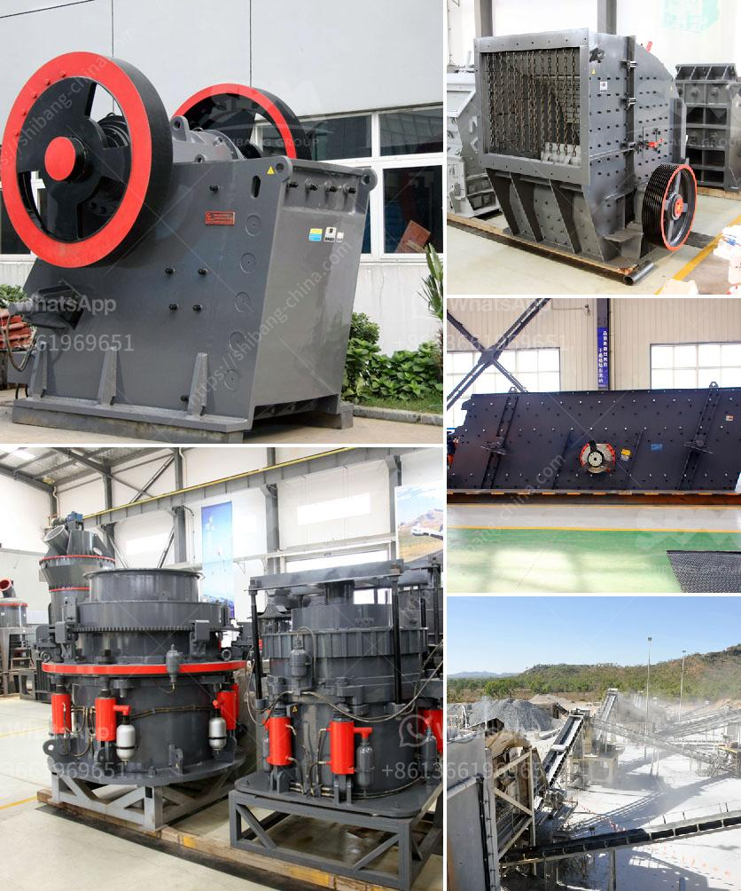

<h3>ball mill feed spout sale</h3>
The ball mill feed spout is a crucial component for successful grinding and processing of materials in the ball mill. It is responsible for delivering the right grinding media into the chamber at the right time and ensuring optimal grinding performance.

A poorly designed or malfunctioning feed spout can cause inefficient grinding, clogging of the mill, and loss of production. Therefore, it is essential to have a properly functioning feed spout to ensure smooth operations and maximize the productivity of the ball mill.

For this reason, the sale of ball mill feed spouts has become an essential part of the aftermarket industry. Many mill operators and manufacturers understand the significance of having a high-quality feed spout to enhance their mill's performance.

During the sale of ball mill feed spouts, several factors need to be considered. Firstly, the design and construction of the feed spout should be carefully examined. It should be made of durable materials that can withstand the harsh grinding environment and resist wear and tear over time.

Furthermore, the dimensions of the feed spout should be suitable for the specific ball mill model. It should precisely fit into the mill, ensuring a tight seal and preventing any material leakage or spillage.

The sale of ball mill feed spouts should also include proper installation procedures and guidelines. It is important to ensure that the feed spout is correctly attached to the mill and aligned with the grinding chamber to guarantee efficient material flow.

Moreover, the sale of ball mill feed spouts should come with reliable customer support and after-sales service. Mill operators should be able to seek assistance or replacement if any issues arise with the feed spout.

In conclusion, the sale of ball mill feed spouts is critical for mill operators and manufacturers to optimize their grinding operations and maximize productivity. A well-designed and properly functioning feed spout is crucial for smooth material flow and efficient grinding. Therefore, it is essential to choose a reputable supplier that offers high-quality feed spouts and reliable customer support.
<h3>Contact us</h3><ul><li><strong>Whatsapp:&nbsp;<a href="https://wa.me/8613661969651">+8613661969651</a></strong></li><li><a href="https://swt.shibang-china.com/?git&amp;zhl&amp;ball mill feed spout sale"><strong>Online Service(chat now)</strong></a></li></ul><h3>Related</h3><ul><li><a href='stone crushers manufacturer.md'>stone crushers manufacturer</a></li><li><a href='used crusher price in nigeria.md'>used crusher price in nigeria</a></li><li><a href='vibrating screen capacity calculation.md'>vibrating screen capacity calculation</a></li><li><a href='counties roller mills.md'>counties roller mills</a></li><li><a href='gypsum manufacturer in ethiopia.md'>gypsum manufacturer in ethiopia</a></li></ul>