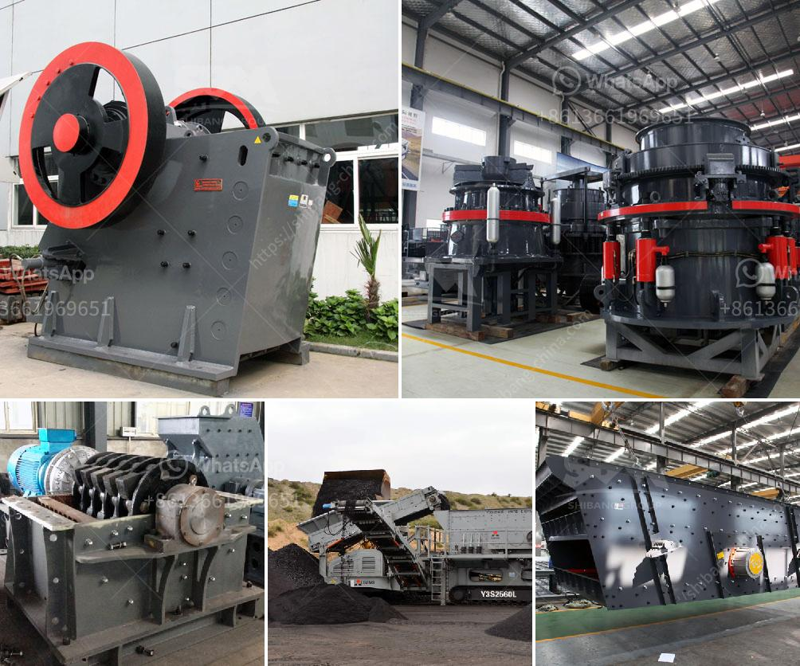

<h3>ball mill for cement</h3>
The ball mill plays an important role in the cement industry, and it is one of the most critical machines in the grinding process. The ball mill efficiency is influenced by various factors, including the feed rate, ball size, and grinding media distribution. The grinding efficiency is of utmost importance in cement production. A ball mill with a high efficiency separator will yield a circuit with lower specific energy consumption. However, the proper ball mill design and calculation can improve grinding efficiency.

1. Efficiency and production rate: Cement ball mills are commonly used in cement production lines to grind clinker and raw materials in the cement industry. The ball mill production capacity depends on the mineral material hardness, grindability, feeding size, and discharge size requirements.

2. Grinding media in cement ball mills: Grinding ball material is chrome steel, alloy steel, carbon steel, etc. It can be classified into dry grinding ball mill and wet grinding ball mill. The ball mill used in the cement industry has a length to diameter ratio of 3 to 5.

3. Factors affecting ball mill efficiency: Ball mill efficiency depends on the amount of grinding materials, feed rate, raw ore chemical properties, particle size of the grinding materials, and particle size of the material of the grinding mill.

4. Improving ball mill efficiency: To improve the efficiency of the cement ball mill grinding process, several methods can be used. First, examine the size of the feed size, excessive small particles will reduce the grinding efficiency and excessive large feed size will accelerate the attrition of the steel ball. Second, control the filling rate of the steel ball. Third, adjust the moisture content and fineness of the grinding material. Fourth, classify the grinding media ball.

5. Ball mill technology innovation: The mechanical technology used in ball mill equipment has gradually evolved into an automated technology. Several automatic control technologies have been introduced. The control variables include process temperature, grinding system mass flow rate, mill fan flow rate, mill pressure differential, and mill outlet temperature.

6. Energy-saving and environmentally friendly: The ball mill equipment of Hongxing Machinery is the most popular equipment after the crushing machine. It is widely used in the dry type and wet type powder grinding of all kinds of ores and other grindable materials in cement, silicate product, new building material, refractory, fertilizer, ferrous and non-ferrous metal ore beneficiation, glass and ceramic industries.

In summary, cement ball mills are suitable for grinding cement raw materials and clinker in the cement plant, cement ball mill with high grinding efficiency, large output, and low energy consumption. The ball mill is a mature device with many advantages, and research on the grinding equipment has focused on energy efficiency and mill liners.
<h3>Contact us</h3><ul><li><strong>Whatsapp:&nbsp;<a href="https://wa.me/8613661969651">+8613661969651</a></strong></li><li><a href="https://swt.shibang-china.com/?git&amp;zhl&amp;ball mill for cement"><strong>Online Service(chat now)</strong></a></li></ul><h3>Related</h3><ul><li><a href='gypsum chromium limestone mining.md'>gypsum chromium limestone mining</a></li><li><a href='roller mill spaider.md'>roller mill spaider</a></li><li><a href='zirconia powder ball mill plant.md'>zirconia powder ball mill plant</a></li><li><a href='wet ball mills manufacturers.md'>wet ball mills manufacturers</a></li><li><a href='conveyor belts in peru.md'>conveyor belts in peru</a></li></ul>