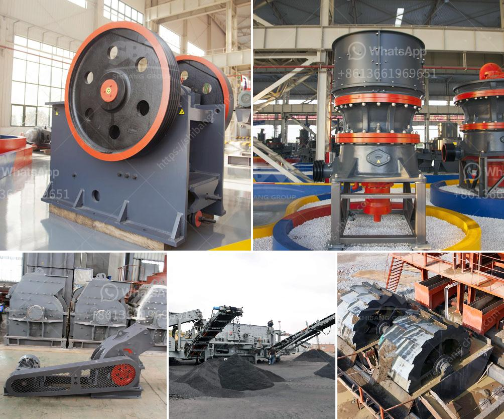

<h3>ball mill for sale</h3>
The ball mill is a common grinding machine used to grind all kinds of minerals and produce ore pulp. It is widely used in mineral processing, building materials and chemical industries. It is the key equipment for crushing materials after crushing. It is widely used in cement, silicate products, new building materials, refractories, chemical fertilizers, black non-ferrous metal beneficiation, glass and ceramics and other industries, and can dry or wet grind various ores and other grindable materials.

The ball mill operates through the rotation of a cylinder with steel grinding balls, which cause the balls to fall back into the cylinder and onto the material to be ground. Depending on the rotation speed of the mill, the grinding medium is carried to a certain height and then falls back, causing heavy impact and grinding on the material. After the material reaches the required particle size, it is discharged through the discharge grate plate.

The ball mill for sale comes with a variety of specifications, ranging from 0.3-615t/h, and the feed size is ≤25mm or ≤30mm. The configuration of the ball mill grinder for sale is different with each different manufacturer.

In general, the Ball Mill consists of a cylindrical drum, sometimes tapered at one end, and usually has a charge of steel balls (up to 40% by volume) ranging in size up to 125mm for larger mills. Product size can be as small as 0.005mm, but product size is dependant upon the time the charge spends in the grinding zone and therefore the reduction rate is a function of the throughput.

The ball mill for sale is efficient and energy-saving, its roller rubber ball, aspheric side plate, combined feeder, screw feeder, drum feeder and other new energy-saving technologies greatly reduce the energy consumption of grinding materials, compared with the traditional ball mill, energy-saving more than 25%.

In terms of operation, the Ball Mill has a larger production capacity and higher efficiency than the ball mill with the same power consumption. During the grinding process, the grinding roller drives the grinding ball to rotate under the action of centrifugal force, effectively achieving the grinding effect of materials. It also adopts forced negative pressure and pulse dust removal system, which greatly reduces the dust pollution and noise in the production process, creating a green and clean production environment.

The Ball Mill for sale is equipped with a lining plate, a wear-resistant steel plate, and a discharge grid plate, which can optimize the grinding process and improve the production efficiency. The Ball Mill for sale also has a good sealing performance to prevent dust overflow.

Based on the above analysis, the Ball Mill for sale is more suitable for grinding materials with higher hardness, such as minerals and metal ores. So what are you waiting for? Contact a reliable ball mill manufacturer today and get your own ball mill to boost your production efficiency and enjoy a great return on investment.
<h3>Contact us</h3><ul><li><strong>Whatsapp:&nbsp;<a href="https://wa.me/8613661969651">+8613661969651</a></strong></li><li><a href="https://swt.shibang-china.com/?git&amp;zhl&amp;ball mill for sale"><strong>Online Service(chat now)</strong></a></li></ul><h3>Related</h3><ul><li><a href='crusher plants in sri lanka.md'>crusher plants in sri lanka</a></li><li><a href='tanzania medical equipment supplier.md'>tanzania medical equipment supplier</a></li><li><a href='dolomite processing equipment.md'>dolomite processing equipment</a></li><li><a href='grinding in vertical roller mill.md'>grinding in vertical roller mill</a></li><li><a href='cost of 5 000 tpd cement project ore processing.md'>cost of 5 000 tpd cement project ore processing</a></li></ul>